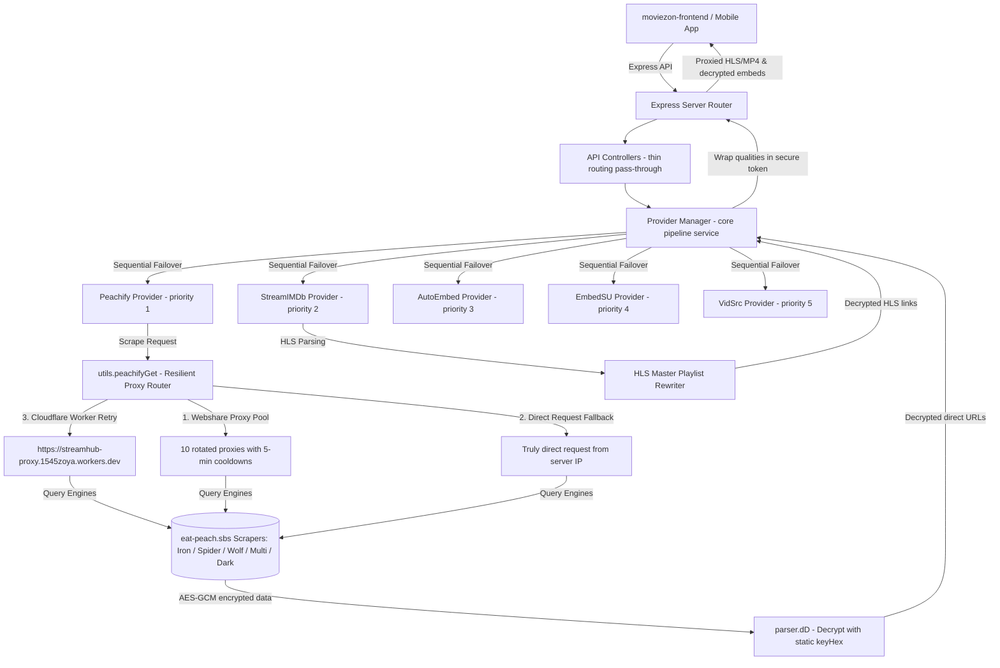

# MovieZon API & Stream Flow Documentation

This document provides a comprehensive technical overview of the **MovieZon Backend API**, detailing its multi-provider architecture, resilient scraping pipeline, dynamic proxy rotation pool, HLS playlist rewriting proxy, secure download tokenization, caching policies, and core lifecycles.

> [!IMPORTANT]
> **Core Architecture Rules (Enforced in Code):**
> 1. **TMDB = Metadata & Discovery Only:** TMDB is **never** a streaming or download provider. It is the metadata source for titles, cast, genres, trailers, and seasons.
> 2. **Multi-Provider Priority Architecture:** The backend supports 5 registered providers: `Peachify`, `StreamIMDb`, `AutoEmbed`, `EmbedSU`, and `VidSrc`. They are registered in the `ProviderManager` and checked in a prioritized sequence.
> 3. **ProviderManager is the Single Source of Truth:** `ProviderManager` handles all pipeline operations (`resolveDetails`, `resolveStream`, `resolveDownload`) and coordinates database queries, TMDB metadata fetches, caching, and fallback checks.
> 4. **No Raw CDN Exposure:** Playback CDN links are proxy-redirected or run through Cloudflare Workers. Download CDN URLs are encrypted using secure AES-256-cbc tokens (`playerService.encryptToken`) and are never exposed as plain text to the frontend.
> 5. **Frontend Agnosticism:** The frontend (React / Flutter) never selects a provider or scraper engine. It invokes backend pipeline endpoints (e.g. `/api/v2/stream/auto/:tmdbId` and `/api/v2/download/auto/:tmdbId`) and receives standardized responses.

---

## 🏗️ Architecture Overview

The backend acts as an intelligent proxy, catalog resolver, and security boundary between client applications (web/mobile) and the scraping APIs.



### Active Directory Folder Structure
```
moviezon-backend/
├── src/
│   ├── app/                      # Express app configurations & CORS setup
│   ├── cache/                    # Memory cache service (node-cache wrapper)
│   ├── config/                   # Global configuration parameters
│   ├── controllers/              # Request handlers (apiController.js, historyController.js)
│   ├── logger/                   # Winston logger utility
│   ├── routes/                   # API routes definition (api.js)
│   ├── server.js                 # HTTP server runner and process lifecycles
│   ├── services/                 # Core backend business logic
│   │   ├── player/               # Token encryption, HLS rewriting, and stream proxying
│   │   ├── provider-manager/     # Unified details, stream, and download resolution pipelines
│   │   └── tmdb/                 # TMDB discovery and normalization wrapper
│   ├── providers/                # Scraping providers
│   │   ├── BaseProvider.js       # Abstract base class enforcing provider contracts
│   │   ├── peachify/             # Peachify scraper provider (priority 1)
│   │   ├── streamimdb/           # StreamIMDb scraper provider (priority 2)
│   │   ├── autoembed/            # AutoEmbed player provider (priority 3)
│   │   ├── embedsu/              # EmbedSU player provider (priority 4)
│   │   └── vidsrc/               # VidSrc player provider (priority 5)
│   └── utils/                    # Data normalizer helpers (normalizer.js)
```

---

## 🔄 Core Lifecycles & Flows

### 1. Unified Search Flow
When a user searches for a movie or TV show, queries go to TMDB first. If TMDB returns empty, the backend falls back to query the in-memory search method of registered providers.

```mermaid
sequenceDiagram
    autonumber
    Client->>Server: GET /api/v2/search?q=Swapped
    Server->>Controllers: Controllers.search("Swapped")
    
    rect rgb(20, 20, 30)
        Note over Controllers: Phase 1: TMDB Query
        Controllers->>TMDB API: GET /search/multi?query=Swapped
        alt TMDB Success
            TMDB API-->>Controllers: Return normalized catalog array
        else TMDB Empty / Failure
            Controllers->>Provider Manager: Manager.search("Swapped")
            Provider Manager->>Cache Service: Cache GET (search:swapped)
            alt Cache Hit
                Cache Service-->>Provider Manager: Return Cached Results
            else Cache Miss
                Provider Manager->>Peachify: Peachify.search("Swapped")
                Peachify-->>Provider Manager: []
                Provider Manager->>StreamIMDb: StreamIMDb.search("Swapped")
                StreamIMDb-->>Provider Manager: []
            end
            Provider Manager-->>Controllers: Return matches
        end
    end
    
    Controllers-->>Client: 200 OK (Standard normalized Catalog JSON)
```



---

### 2. Unified Details & Availability Flow
The details pipeline resolves rich TMDB metadata and queries all registered providers sequentially to determine streaming and download availability.

```mermaid
sequenceDiagram
    autonumber
    Client->>Server: GET /api/v2/details/tmdb/1007757?type=movie
    Server->>Manager: Manager.resolveDetails(1007757, movie)
    
    rect rgb(20, 20, 30)
        Note over Manager: Phase 1 — Metadata Resolution
        Manager->>TMDB Service: fetchDetails(1007757, movie)
        TMDB Service-->>Manager: Returns rich details (title, genres, cast, rating)
    end
    
    rect rgb(10, 30, 10)
        Note over Manager: Phase 2 — Multi-Provider Availability Check
        loop For Each Provider (Sorted by Priority)
            Manager->>Provider: Provider.stream(1007757, movie)
            Provider-->>Manager: Returns stream or embed details
            Note over Manager: Mark provider availability status (ONLINE/UNAVAILABLE/OFFLINE)
        end
    end
    
    Manager-->>Server: Combined details + sources availability nodes
    Server-->>Client: 200 OK (Normalized results including sources, player, and download nodes)
```



---

### 3. Playback Stream Flow (`resolveStreamAuto`)
Invoking `/api/v2/stream/auto/:tmdbId` triggers the sequential failover streaming pipeline. It tests providers according to priority, caching successful provider selections to optimize subsequent runs.

```mermaid
sequenceDiagram
    autonumber
    Client->>Server: GET /api/v2/stream/auto/1007757?type=movie
    Server->>Manager: Manager.resolveStream(1007757, movie, season=1, episode=1)
    
    Manager->>Cache Service: Cache GET (pipeline:movie:1007757:1:1:default)
    alt Cache Hit
        Cache Service-->>Manager: Return cached stream details
    else Cache Miss
        Note over Manager: Fetch priority list & check for last successful provider
        loop Try Each Provider
            rect rgb(25, 25, 35)
                Note over Manager: Check diagnostic status (Skip if offline)
                Manager->>Provider: provider.stream(...)
                alt Success
                    Provider-->>Manager: Return playable stream / embed details
                    Note over Manager: Cache selected provider (15-min TTL)
                else Failure
                    Note over Manager: Fallback to next provider
                end
            end
        end
        Manager->>Cache Service: Cache SET (pipeline:..., TTL: 1800s)
    end
    
    Manager-->>Server: Playback stream specifications
    Server-->>Client: 200 OK (JSON specifying selectedProvider, streamType, embedUrl/streamUrl)
```



---

### 4. Download Resolution Flow (`resolveDownloadAuto`)
Downloads are handled by the sequential failover download pipeline at `/api/v2/download/auto/:tmdbId`. It queries providers supporting download capabilities, wrapping URLs in secure tokens.

```mermaid
sequenceDiagram
    autonumber
    Client->>Server: GET /api/v2/download/auto/1007757?type=movie
    Server->>Manager: Manager.resolveDownload(1007757, movie)
    
    loop Try Each Download-supporting Provider
        Manager->>Provider: Provider.download(1007757, movie)
        alt Provider Success
            Provider-->>Manager: Return raw qualities (HLS / direct link)
        else Failure
            Note over Manager: Fallback to next provider
        end
    end
    
    rect rgb(30, 20, 20)
        Note over Manager: Secure Link Generation (apiController)
        Manager->>Player Service: encryptToken({url, headers, filename})
        Player Service-->>Manager: secureToken String
    end
    
    Manager-->>Server: Qualities array with proxied & tokenized URLs
    Server-->>Client: 200 OK (JSON with tokenized download URLs)
```



---

## 💾 Resilient Proxy & Health Monitor

### 1. Outbound Scraper Request Flow (`peachifyGet`)
Outbound scraping requests (for Peachify) use a multi-tier proxy pipeline to maintain scraping continuity in cloud environments (like Render) which frequently have blocked datacenter IPs.
- **Layer 1 (Primary Proxy)**: Custom residential proxy loaded from `PROXY_URL` environment variable.
- **Layer 2 (Fallback Pool)**: 10 static proxies from Webshare dashboard loaded at startup. Any status `402` (Payment Required) or network error places that proxy on a **5-minute cooldown**.
- **Layer 3 (Truly Direct)**: Direct requests via the host server's IP, used if all proxies fail.
- **Layer 4 (Cloudflare Worker)**: Dynamic retry gateway through a Cloudflare Worker that forwards encoded headers.

### 2. Provider Health Checks
A background monitor runs checks every 5 minutes (`300,000ms`) to verify provider availability:
- **Scraper-based Providers (Peachify, StreamIMDb)**: Pings endpoints. Peachify's health check maps `402` (Payment Required), `403`, and `429` statuses to a `degraded` state instead of `unhealthy` to keep it marked `online` despite proxy limit messages.
- **Embed-only Providers (AutoEmbed, EmbedSU, VidSrc)**: Health check failures (due to server-side network limits or Cloudflare challenges) return `status: 'degraded'` rather than `unhealthy`. Since embed URLs are resolved on the client browser and cost `0ms` on the backend, these providers are never marked offline and skipped by the sequential pipeline.

---

## 🔒 Security & Stream Proxy Pipeline

To protect the server, enforce CORS, bypass IP blocks, and parse chunked contents, the backend runs a stream proxy at `/api/v2/stream/proxy`.

### 1. Download Token Encryption (`playerService.encryptToken`)
Download URLs are protected from tampering and IP leakages by wrapping them in secure, temporary state tokens:
* **Algorithm:** `AES-256-CBC`
* **Encryption Key:** Automatically generated at server startup (`PROXY_TOKEN_SECRET`).
* **Payload:** Contains target CDN URL, custom download request headers, and custom formatted target filename (e.g. `Swapped_S1E1_1080p.mp4`).
* **Route:** `/api/v2/download/proxy?token={iv:encryptedData}`

### 2. Live HLS (.m3u8) Playlist Rewriting
When an HLS stream (`.m3u8` playlist) is played through the proxy, the proxy fetches the playlist file, rewrites it line-by-line, and returns the modified string:
* **Media Segments & Keys:** Any segment URLs or alternate encryption keys (lines starting with `#EXT-X-KEY` or uri segments) are converted to route back through the stream proxy.
* **Alternate Tracks:** Alternate audio streams (e.g., multilingual track listings) and subtitle tracks defined in `#EXT-X-MEDIA:TYPE=AUDIO` or `TYPE=SUBTITLES` are rewritten dynamically to point to the proxy endpoint, preserving custom headers.

---

## 💾 Caching Strategy

MovieZon uses an in-memory `node-cache` service to minimize outbound API fetches, lower TMDB quota rates, and ensure fast details lookups.

| Cache Type | TTL (Seconds) | Key Pattern | Purpose |
| :--- | :--- | :--- | :--- |
| **Search** | 600s (10 min) | `search:{query}` | Caches TMDB search queries and catalog results. |
| **Details** | 1800s (30 min) | `details:resolved:{type}:{tmdbId}` | Stores TMDB metadata combined with verified provider availability. |
| **Stream (Explicit)** | 1800s (30 min) | `stream:{provider}:{type}:{id}:{se}:{ep}:{variant}:{ip}` | Caches explicit stream results. |
| **Pipeline Stream** | 1800s (30 min) | `pipeline:{type}:{tmdbId}:{se}:{ep}:{variantId}` | Caches stream requests resolved by the sequential pipeline. |
| **Last Successful Provider** | 900s (15 min) | `last_success_stream_provider:${tmdbId}` <br>`last_success_download_provider:${tmdbId}` | Prioritizes the last successful provider for a title. |

---

## 🌐 API Endpoint Reference

### 1. Search Catalog
`GET /api/v2/search?q={query}`

---

### 2. Unified Details
`GET /api/v2/details/tmdb/:id?type={movie|tv}`

Fetches TMDB metadata and combines it with availability checks on all registered providers.

---

### 3. Resolve Stream (Auto Failover)
`GET /api/v2/stream/auto/:tmdbId?type={movie|tv}&season={se}&episode={ep}`

Sequentially tries available providers by priority, caching the successful stream.

**Response Schema:**
```json
{
  "ok": true,
  "success": true,
  "available": true,
  "provider": "peachify",
  "selectedProvider": "peachify",
  "fallbackTriggered": false,
  "subjectId": "1007757",
  "streamType": "embed",
  "embedUrl": "https://peachify.top/embed/movie/1007757",
  "embedFallbacks": [
    "https://peachify.top/embed/movie/1007757",
    "https://vidsrcme.su/embed/movie/1007757"
  ]
}
```

---

### 4. Resolve Download (Auto Failover)
`GET /api/v2/download/auto/:tmdbId?type={movie|tv}&season={se}&episode={ep}`

Sequentially queries download-supporting providers and returns token-encrypted direct proxy links.

**Response Schema:**
```json
{
  "ok": true,
  "success": true,
  "available": true,
  "provider": "peachify",
  "downloadSupported": true,
  "languages": [{"id": "en", "name": "English"}],
  "qualities": [
    {
      "quality": "1080p",
      "url": "http://localhost:3000/api/v2/download/proxy?token=6f23ae9a1b0213..."
    }
  ]
}
```

---

### 5. Watch History
Endpoints used to manage watch progress and history cards. Capped at 100 entries locally (`data/history.json`).

#### A. Fetch History
`GET /api/v2/history`

#### B. Save History
`POST /api/v2/history`

Saves or updates watch history progress.
* **Request Payload:** `{ movie: { id, title, type, posterPath }, progress: 350, duration: 5640, playContext: { provider, id } }`
* **Response:** `{ ok: true, success: true, item: { ... } }`

#### C. Remove Entry
`DELETE /api/v2/history/:type/:id`

#### D. Clear History
`DELETE /api/v2/history`

---

### 6. Providers Status
`GET /api/providers`
* **Response:** `{ ok: true, providers: [{ name: "peachify", displayName: "Peachify", priority: 1, status: "healthy", message: "Operational", responseTimeMs: 0, lastChecked: "..." }] }`

### 7. Health Check
`GET /api/health`
* **Response:** `{ status: "ok", timestamp: "...", uptime: "...", providers: { peachify: { status: "healthy", message: "Peachify reachable", responseTimeMs: 142 } } }`

---

## ⚡ Integration Testing & Verification

The integrity of the API manager pipelines, caching layers, and token routing is verified using a comprehensive test suite.

### Test Suite Execution
Run the integration tests using:
```powershell
node verify-v2-providers.js
```

### Key Test Coverages
1. **Details Pipeline:** Verifies sequential calling, caching layers, and details enrichment flows.
2. **Stream Pipeline:** Verifies that resolving stream returns correct provider configurations.
3. **Download Pipeline:** Verifies that download links are generated with token parameters.
4. **HLS Playlist Rewriter:** Asserts that HLS playlists are correctly rewritten with proxy variables.
5. **Proxy Rotation Test Bypass:** Confirms that `isTestEnv` prevents tests from running requests through Webshare proxies, keeping test executions clean and deterministic.