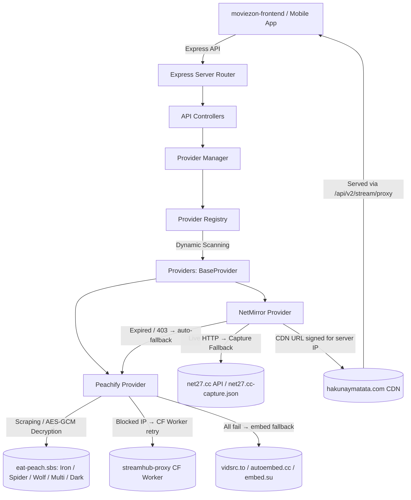
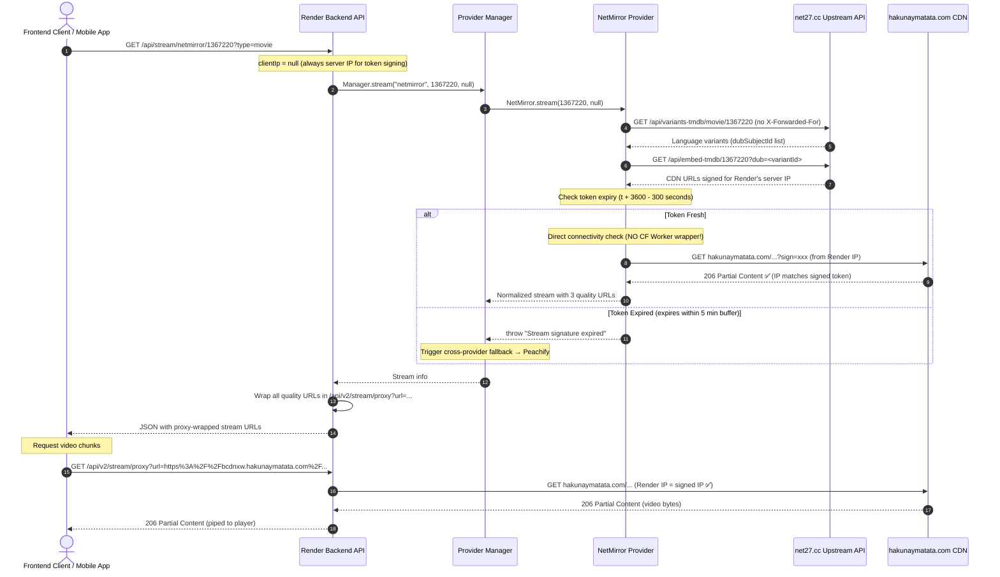
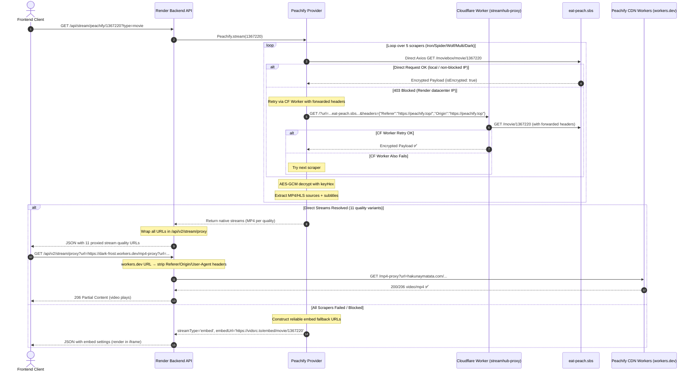
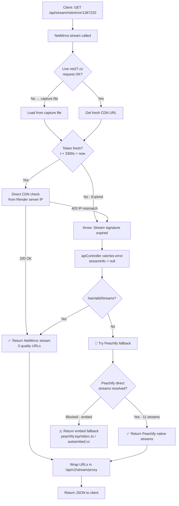

# MovieZon API & Stream Flow Documentation

This document provides a comprehensive technical overview of the **MovieZon Backend API**, detailing its plugin-based provider architecture, multi-provider discovery system, automatic cross-provider fallback, caching strategies, and the specialized proxy pipeline designed to deliver streams reliably from both local and production (Render) environments.

---

## 🏗️ Architecture Overview

MovieZon Backend is built on a **decoupled, provider-driven architecture**. The core server is agnostic to where media content is hosted or how third-party providers lay out their metadata.



### Key Components

1. **Express Server & Router** (`src/app/` & `src/routes/`): Gateway enforcing request validation, CORS proxying, and streaming data piping.
2. **Provider Registry** (`src/provider-registry/`): Discovers concrete sub-providers dynamically at startup by scanning directories within `src/providers/`.
3. **Provider Manager** (`src/provider-manager/`): Orchestrates queries across providers, handles merge/de-duplication, implements timeouts, and drives automatic failover routing.
4. **BaseProvider Contract** (`src/providers/BaseProvider.js`): Abstract class defining the required interface for `search`, `details`, `stream`, and `health`.
5. **Concrete Providers**:
   * **NetMirror** (`src/providers/netmirror/`): Translates requests into `net27.cc` API calls, falling back to a pre-indexed local catalog file. CDN URLs are IP-signed for the **backend server's IP** so the backend proxy can serve them correctly.
   * **Peachify** (`src/providers/peachify/`): Fetches & AES-GCM-decrypts encrypted payloads from `eat-peach.sbs`. Supports optional outbound residential proxy routing via the `PROXY_URL` environment variable. If the direct/proxied scraper request fails, it retries via a Cloudflare Worker proxy (`streamhub-proxy`) with forwarded headers. If all scraping fails, returns an iframe embed fallback.

---

## 🔄 Core Lifecycles & Flows

### 1. Catalog Search Flow

When a user searches for a movie or TV show, queries go to TMDB first. If TMDB returns empty or fails, the backend falls back to the in-memory local catalog built from NetMirror capture indices.

```mermaid
sequenceDiagram
    autonumber
    Client->>Express Server: GET /api/search?q=Karuppu
    Express Server->>Controllers: Controllers.search("Karuppu")

    rect rgb(20, 20, 30)
        Note over Controllers: Phase 1: TMDB Query
        Controllers->>TMDB API: GET /search/multi?query=Karuppu
        alt TMDB Success
            TMDB API-->>Controllers: Return catalog array
        else TMDB Failure / Empty
            Controllers->>Provider Manager: Manager.search("Karuppu")
            Provider Manager->>Cache Service: Cache GET (search:karuppu)
            alt Cache Hit
                Cache Service-->>Provider Manager: Return Cached Results
            else Cache Miss
                Provider Manager->>NetMirror: NetMirror.search("Karuppu")
                Note over NetMirror: Search local catalog in-memory db (262 titles)
                NetMirror-->>Provider Manager: Return local matches
                Provider Manager->>Cache Service: Cache SET (search:karuppu, TTL: 600s)
            end
            Provider Manager-->>Controllers: Return matches
        end
    end

    Controllers-->>Client: 200 OK (Normalized MovieZon JSON)
```



---

### 2. NetMirror Stream Flow (Server-IP Signing)

> [!IMPORTANT]
> `clientIp` is **always `null`** in the stream handler. This means `net27.cc` signs all CDN URLs for the **backend server's IP** (e.g. Render's IP). Since all stream URLs are delivered through the backend proxy (`/api/v2/stream/proxy`), the proxy fetches the CDN from the **same server IP** that the token was signed for → `200 OK`. Forwarding the client's residential IP would cause the proxy to get `403 Forbidden` because the client IP ≠ Render's proxy IP.



---

### 3. Peachify Scraper & Stream Flow

Peachify resolves direct streams by fetching and AES-GCM-decrypting encrypted payloads from 5 `eat-peach.sbs` scraper APIs. To bypass datacenter IP blocks (e.g., on Render), Peachify supports routing scraper requests through an optional residential proxy configured via the `PROXY_URL` environment variable.

If the direct scraper request (using the residential proxy, if configured) fails, the provider retries via a Cloudflare Worker proxy (`streamhub-proxy`) that forwards the required `Referer`/`Origin` headers encoded in its query string. If both the direct/proxied and Cloudflare Worker requests fail, Peachify falls back to constructing direct iframe embed URLs.



---

### 4. Cross-Provider Automatic Fallback Flow

When NetMirror's CDN URLs are expired or return `403`, the stream handler automatically retries with Peachify **before** returning a `404` to the client.



---

## 💾 Failover & Fallback Layers

### NetMirror Fallback Matrix

| Layer | Trigger | Action |
|-------|---------|--------|
| **1. Live API** | Always tried first | `GET net27.cc/api/embed-tmdb/...` (no client IP forwarded) |
| **2. CF Worker** | Live API network error | Retry via `streamhub-proxy.1545zoya.workers.dev` |
| **3. Capture File** | Live API empty/blocked | Serve from `net27.cc-capture.json` (local static data) |
| **4. Token Expiry** | `t + 3300s < now` | Throw → triggers cross-provider fallback |
| **5. CDN Check** | Always (direct fetch, no proxy) | `GET hakunaymatata.com` from Render IP; throw on 403 |
| **6. Cross-Provider** | NetMirror throws / no valid stream | Auto-retry with Peachify |
| **7. Direct Embed** | No variants (e.g. Amaran) | `GET /api/embed-tmdb` without variant ID |
| **8. Local DB Search** | NetMirror search offline | In-memory catalog from capture (262 titles) |

### Peachify Fallback Matrix

| Layer | Trigger | Action |
|-------|---------|--------|
| **1. Direct Request** | Always tried first | `axios.get(eat-peach.sbs/...)` with browser headers |
| **2. CF Worker + Headers** | Direct returns 403 | Retry via `streamhub-proxy` with `headers=` query param encoding `Referer`, `Origin`, `User-Agent` |
| **3. Next Scraper** | Both fail | Loop to next of 5 scrapers (Iron → Spider → Wolf → Multi → Dark) |
| **4. Embed Fallback** | All 5 scrapers fail | Return `streamType: 'embed'` with `peachify.top/vidsrc.to`, `autoembed.cc`, `embed.su` URLs |

### Details Page Safety Net

When loading a title's unified details (`GET /api/details/:id`), the API checks provider availability in parallel. If **neither NetMirror nor Peachify** resolve an active stream, the controller dynamically appends **Peachify (Server 2)** as a safety-net source in the `sources` array.

---

## ⚡ Caching Strategy

MovieZon uses an in-memory Node-Cache system with TTL rules:

| Cache Type | TTL | Key Pattern |
|-----------|-----|-------------|
| **Search** | 600s (10 min) | `search:{query}` |
| **Details** | 3600s (1 hour) | `details:{provider}:{type}:{id}` |
| **Stream** | 1800s (30 min) | `stream:{provider}:{type}:{id}:{se}:{ep}:{variant}` |
| **Availability** | 300s (5 min) | `availability:{id}:{type}:{se}:{ep}` |

> [!IMPORTANT]
> **Stream Cache & Token Expiry**: Stream cache keys no longer include the client IP (since `clientIp = null`). The cache key is `stream:netmirror:movie:1367220:1:1:null`. If a stream URL's token is determined to expire within **5 minutes** (`t + 3300 < now`), the cached entry is bypassed and evicted immediately, and a fresh request is made to generate a new token.

---

## 🌐 API Endpoint Reference

### 1. Unified Search
`GET /api/search?q={query}`
`GET /api/v2/search?q={query}`

**Query Parameters:**
* `q` (string, required): Search query.

**Example Response:**
```json
{
  "ok": true,
  "success": true,
  "count": 1,
  "items": [
    {
      "id": "1367220",
      "provider": "netmirror",
      "tmdbId": 1367220,
      "title": "Karuppu",
      "originalTitle": "Karuppu",
      "year": 2026,
      "type": "movie",
      "language": "ta",
      "quality": "1080p",
      "poster": "https://image.tmdb.org/t/p/w185/...",
      "backdrop": "https://image.tmdb.org/t/p/w780/...",
      "overview": "...",
      "rating": "TMDB 7.1",
      "providers": ["netmirror"]
    }
  ]
}
```

---

### 2. Title Details (Unified Metadata & Availability)
`GET /api/details/:id?type={movie|tv}&season={se}&episode={ep}`
`GET /api/v2/details/tmdb/:id?type={movie|tv}&season={se}&episode={ep}`

Fetches rich TMDB metadata and checks stream availability across all providers in parallel, returning available languages, variants, and server options.

**Example Response:**
```json
{
  "ok": true,
  "success": true,
  "movie": {
    "id": "1367220",
    "provider": "tmdb",
    "tmdbId": 1367220,
    "title": "Karuppu",
    "overview": "...",
    "poster": "https://image.tmdb.org/t/p/w500/...",
    "year": "2026",
    "rating": "TMDB 7.1",
    "genres": ["Action", "Thriller"],
    "cast": [{ "name": "Actor Name", "character": "Role", "profilePath": "..." }],
    "seasons": [],
    "sources": [
      {
        "provider": "netmirror",
        "id": "799599864534515856",
        "languages": ["Tamil Dubbed"]
      },
      {
        "provider": "netmirror",
        "id": "1367220",
        "languages": ["Original Audio"]
      },
      {
        "provider": "peachify",
        "id": "1367220",
        "languages": ["Original Audio"],
        "label": "Server 2 (Peachify)",
        "streamType": "embed"
      }
    ]
  }
}
```

---

### 3. Stream Resolution
`GET /api/stream/:provider/:id?type={movie|tv}&season={1}&episode={1}&variant={variantId}`
`GET /api/v2/stream/:provider/:id?type={movie|tv}&season={1}&episode={1}&variant={variantId}`

Resolves streaming source links, subtitles, and configuration. Automatically falls back to Peachify if NetMirror CDN URLs are expired or unavailable.

**Path Parameters:**
* `:provider` (string): Target provider (`netmirror` or `peachify`).
* `:id` (string/number): TMDB ID, composite TV ID (e.g. `71912-1-2`), or variant/dub ID.

**Query Parameters:**
* `type` (string, required): `movie` or `tv`.
* `season` (number, optional): TV season number (defaults to `1`).
* `episode` (number, optional): TV episode number (defaults to `1`).
* `variant` (string, optional): Specific language variant/dub ID (NetMirror).
* `download` (boolean, optional): If `true`, appends `Content-Disposition: attachment` for direct download.

> [!NOTE]
> The `download` query param no longer changes client IP forwarding behavior. `clientIp` is always `null` — all stream URLs are signed for the backend server IP and served exclusively through the backend proxy.

**Example Response — Native Direct Stream (NetMirror or Peachify scraper success):**
```json
{
  "ok": true,
  "success": true,
  "provider": "netmirror",
  "subjectId": "1367220",
  "streams": [
    {
      "quality": "360p",
      "url": "https://moviezon-api.onrender.com/api/v2/stream/proxy?url=https%3A%2F%2Fbcdnxw.hakunaymatata.com%2F..."
    },
    {
      "quality": "1080p",
      "url": "https://moviezon-api.onrender.com/api/v2/stream/proxy?url=https%3A%2F%2Fbcdnxw.hakunaymatata.com%2F..."
    }
  ],
  "subtitles": [
    { "lang": "en", "name": "English", "url": "https://moviezon-api.onrender.com/api/v2/stream/proxy?url=..." }
  ],
  "stream": {
    "provider": "netmirror",
    "drm": false,
    "streamUrl": "https://moviezon-api.onrender.com/api/v2/stream/proxy?url=...",
    "qualities": [{ "quality": "360p", "url": "..." }, { "quality": "1080p", "url": "..." }],
    "variants": [
      { "id": "1367220", "language": "Original Audio" },
      { "id": "799599864534515856", "language": "Tamil Dubbed" }
    ],
    "expires": 1781940000,
    "headers": { "User-Agent": "Mozilla/5.0 ...", "Referer": "https://net27.cc/" }
  }
}
```

**Example Response — Embed Fallback (all scrapers blocked):**
```json
{
  "ok": true,
  "success": true,
  "provider": "peachify",
  "subjectId": "1367220",
  "streamType": "embed",
  "embedUrl": "https://vidsrc.to/embed/movie/1367220",
  "embedFallbacks": [
    "https://vidsrc.to/embed/movie/1367220",
    "https://autoembed.cc/movie/1367220",
    "https://embed.su/embed/movie/1367220"
  ],
  "streams": [],
  "subtitles": []
}
```

---

### 4. Stream Proxy (CORS, Referer & IP-Signing Bypass)
`GET /api/v2/stream/proxy?url={url}&headers={headers}&download={true|false}`
`GET /api/proxy-stream?url={url}&headers={headers}`

Proxies raw video binary streams to bypass CORS, Referer, and IP-restriction checks enforced by streaming CDNs.

**Query Parameters:**
* `url` (string, required): The target stream URL to proxy.
* `headers` (string, optional): URL-encoded JSON string of extra headers to forward to the target.
* `download` (boolean, optional): If `true`, adds `Content-Disposition: attachment` for direct download.
* `filename` (string, optional): Filename for download (defaults to `video.mp4`).

**Key Proxy Logic:**

| Rule | Condition | Action |
|------|-----------|--------|
| **Skip re-proxy** | URL already contains `/stream/proxy` or `/proxy-stream` | Return URL as-is (no double-wrapping) |
| **Extract nested URL** | URL is wrapped in an `eat-peach.sbs` or `peachify` proxy wrapper (contains `?url=...`) | Extract and proxy the nested target URL directly to bypass blocked scraper hostnames |
| **CF Worker redirection** | `hakunaymatata.com` URL (and NOT a download or subtitle request) | Wrap/redirect the request to `streamhub-proxy.1545zoya.workers.dev` to save backend server bandwidth |
| **Direct CDN fetch** | `hakunaymatata.com` URL for downloads or subtitles | Fetch directly from the Render server (no Cloudflare Worker wrapping) to ensure correct IP-signed token matching and direct file downloads |
| **Strip worker headers** | URL contains `workers.dev` | Remove `Referer`, `Origin`, `User-Agent` — the CF Worker manages its own headers to the CDN |
| **HLS rewriting** | URL ends in `.m3u8` or contains `m3u8`/`hls-proxy` | Fetch playlist, rewrite all segment URLs to route through this proxy |
| **Range passthrough** | Client sends `Range: bytes=x-y` | Forward Range header; return `206 Partial Content` for seeking support |

> [!NOTE]
> During video playback, `hakunaymatata.com` CDN URLs are wrapped in `streamhub-proxy.1545zoya.workers.dev` to save backend server bandwidth.
> Subtitles and direct downloads (`download=true`) bypass this Cloudflare Worker proxy wrapping and fetch directly from the backend server to ensure compatibility and correct asset delivery.

---

### 5. Providers List
`GET /api/providers`

Lists active providers, their health status, response times, and priority order.

**Example Response:**
```json
{
  "ok": true,
  "providers": [
    {
      "name": "netmirror",
      "displayName": "Netmirror",
      "priority": 0,
      "status": "healthy",
      "message": "Reachable",
      "responseTimeMs": 73,
      "lastChecked": "2026-06-20T07:05:42.266Z"
    },
    {
      "name": "peachify",
      "displayName": "Peachify",
      "priority": 2,
      "status": "degraded",
      "message": "Peachify unreachable: Request failed with status code 403",
      "responseTimeMs": 123,
      "lastChecked": "2026-06-20T07:05:42.316Z"
    }
  ]
}
```

> [!NOTE]
> Peachify health shows **degraded** on Render because the `peachify.top` homepage is blocked from datacenter IPs. This does **not** affect stream resolution — direct streams are fetched from `eat-peach.sbs` (which uses a CF Worker retry path with forwarded headers).

---

### 6. Health Check Metrics
`GET /api/health`

**Example Response:**
```json
{
  "status": "ok",
  "timestamp": "2026-06-20T07:16:15.000Z",
  "uptime": "0h 10m 15s",
  "memory": {
    "rss": "79 MB",
    "heapTotal": "17 MB",
    "heapUsed": "15 MB"
  },
  "providers": {
    "netmirror": {
      "status": "healthy",
      "message": "Reachable",
      "responseTimeMs": 73,
      "lastChecked": "2026-06-20T07:05:42.266Z"
    },
    "peachify": {
      "status": "degraded",
      "message": "Peachify unreachable: Request failed with status code 403",
      "responseTimeMs": 123,
      "lastChecked": "2026-06-20T07:05:42.316Z"
    }
  }
}
```

---

## 🔑 Key Design Decisions & Known Behaviours

### IP Signing & Backend Proxy
All CDN tokens from `hakunaymatata.com` are signed for the **backend server's IP** (`clientIp = null`). Stream URLs returned to the client are wrapped in `/api/v2/stream/proxy`, which routes playback streams to the Cloudflare Worker proxy (`streamhub-proxy`) to save bandwidth, while routing downloads and subtitles directly via the Render backend server to maintain IP-signed token compatibility.

### CDN Connectivity Check
The connectivity check in `NetMirror.stream()` fetches the CDN URL **directly** (no Cloudflare Worker wrapper). The signed token's IP is Render's server IP. The check runs from Render's server. Same IP = `200 OK`. Using a CF Worker intermediary would introduce a different IP and produce `403`, falsely discarding a valid stream. The checker always throws on failure to ensure cross-provider fallbacks are executed reliably.

### Cross-Provider Fallback
When NetMirror's CDN check fails (token expired or 403), an error is thrown. The `apiController.stream()` handler catches it, detects no valid stream, and **automatically retries with Peachify**. This happens transparently — the client receives either NetMirror or Peachify streams without knowing a failover occurred.

### Peachify on Render (Degraded health, functional streams)
Render's datacenter IP is blocked by `eat-peach.sbs`. Peachify can bypass this by routing scraper requests through a residential proxy configured via the `PROXY_URL` environment variable. If the proxy is not configured or fails, Peachify retries via the `streamhub-proxy` Cloudflare Worker, encoding the required `Referer`, `Origin`, and `User-Agent` headers as a JSON-encoded query parameter (`headers=`). If this also fails (403 from CF Worker), Peachify falls back to embed sources (`vidsrc.to`, `autoembed.cc`, `embed.su`).

### Token Expiry Window
CDN tokens use a `t` Unix timestamp parameter (generation time). Tokens are treated as valid for `3600 − 300 = 3300 seconds` (55 minutes). This 5-minute early-rejection buffer ensures the client never receives a URL that expires mid-playback.
