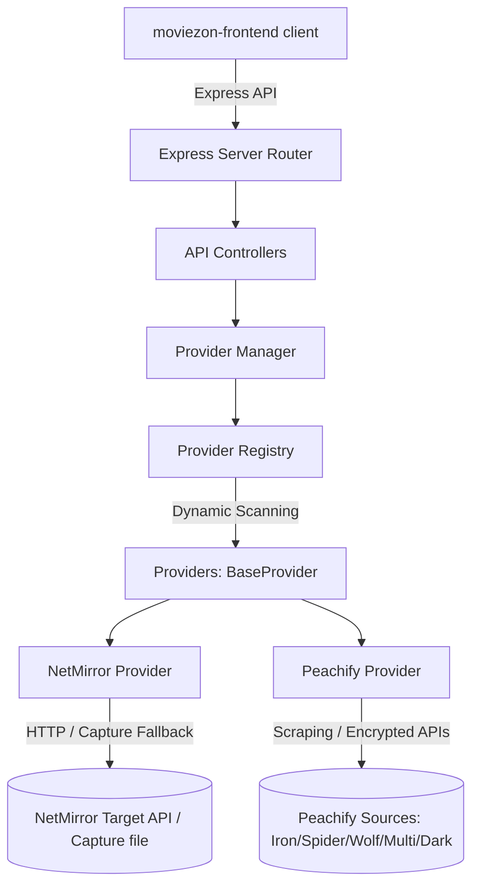
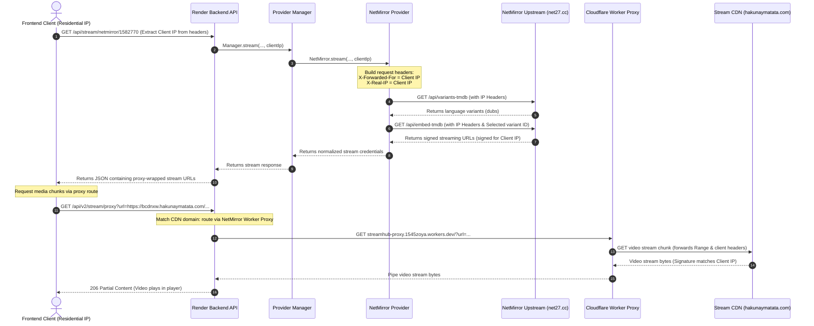
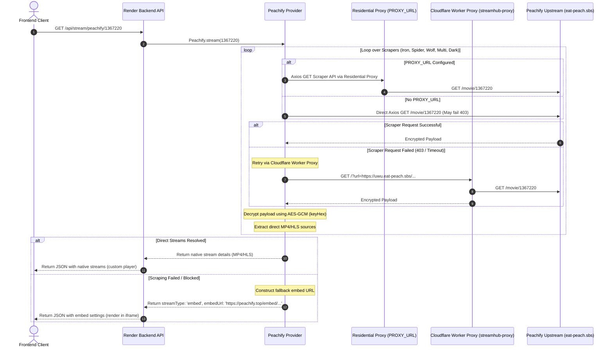

# MovieZon API & Stream Flow Documentation

This document provides a comprehensive technical overview of the **MovieZon Backend API**, detailing its plugin-based provider architecture, multi-provider discovery system, fallback mechanisms, caching strategies, and the specialized proxy pipeline designed to bypass target stream security checks.

---

## 🏗️ Architecture Overview

MovieZon Backend is built on a **decoupled, provider-driven architecture**. The core server is agnostic to where media content is hosted or how third-party providers lay out their metadata. 



### Key Components

1. **Express Server & Router** (`src/app/` & `src/routes/`): Serves as the gateway, enforcing request validation, CORS proxying, and streaming data piping.
2. **Provider Registry** (`src/provider-registry/`): Discovers concrete sub-providers dynamically at startup by scanning directories within `src/providers/`.
3. **Provider Manager** (`src/provider-manager/`): Orchestrates queries across providers, handles merge/de-duplication algorithms, implements timeouts, and drives automatic failover routing.
4. **BaseProvider Contract** (`src/providers/BaseProvider.js`): Abstract class defining the required client interface for `search`, `details`, `stream`, and `health` queries.
5. **Concrete Providers**:
   * **NetMirror** (`src/providers/netmirror/`): Translates requests into NetMirror API requests, falling back to local pre-indexed capture datasets if the target goes offline.
   * **Peachify** (`src/providers/peachify/`): Resolves direct stream sources by scraping multiple backend APIs with decryption keys, falling back to a sandboxed iframe embed player if direct streaming isn't resolvable.

---

## 🔄 Core Lifecycles & Flows

### 1. Catalog Search Flow

When a user searches for a movie or TV show, queries are first sent to TMDB. If TMDB returns empty or fails, the backend falls back to query the local catalog database built from NetMirror indices.

```mermaid
sequenceDiagram
    autonumber
    Client->>Express Server: GET /api/search?q=Dark
    Express Server->>Controllers: Controllers.search("Dark")
    
    rect rgb(20, 20, 30)
        Note over Controllers: Phase 1: TMDB Query
        Controllers->>TMDB API: GET /search/multi?query=Dark
        alt TMDB Success
            TMDB API-->>Controllers: Return catalog array
        else TMDB Failure / Empty
            Controllers->>Provider Manager: Manager.search("Dark")
            Provider Manager->>Cache Service: Cache GET (search:dark)
            alt Cache Hit
                Cache Service-->>Provider Manager: Return Cached Results
            else Cache Miss
                Provider Manager->>NetMirror: NetMirror.search("Dark")
                Note over NetMirror: Search local catalog in-memory db (262 titles)
                NetMirror-->>Provider Manager: Return local matches
                Provider Manager->>Cache Service: Cache SET (search:dark, TTL: 600s)
            end
            Provider Manager-->>Controllers: Return matches
        end
    end
    
    Controllers-->>Client: 200 OK (Normalized MovieZon JSON)
```



---

### 2. Live-Stream Playback & Client IP Forwarding Flow (NetMirror)

Streaming CDNs use signatures locked to the requester's IP. The backend forwards the client's residential IP to NetMirror during variant and embed generation to ensure the signed stream URL is valid for the client browser.



---

### 3. Peachify Scraper Proxy & Fallback Flow

Peachify resolves direct streams by attempting to fetch and decrypt responses from 5 separate scraper APIs. Datacenter IPs are often blocked (403 Forbidden) by Cloudflare, requiring residential proxying and proxy retries.



---

## 💾 Failover & Fallback Mechanism

### Provider Uptime Layers

1. **NetMirror Fallback Matrix**:
   * **Live HTTP Call**: Try direct HTTP calls to `net27.cc`.
   * **CF Worker Proxy**: If blocked, retry requests using the Cloudflare Worker proxy (`streamhub-proxy.1545zoya.workers.dev`).
   * **Captured Responses**: If the live network is down, the provider falls back to reading matching routes from a local static file `net27.cc-capture.json`.
   * **Local Database catalog**: For search queries, if NetMirror is unreachable, query the local in-memory catalog containing metadata extracted from the capture file.
   * **Direct Embed Fallback**: If a title lacks audio variants in the API, the system bypasses variants and requests a direct embed player source.

2. **Peachify Fallback Matrix**:
   * **Axios Outbound Proxy**: Route requests through a custom residential proxy server (configured via the environment variable `PROXY_URL`).
   * **CF Worker Proxy**: Fall back to the Cloudflare Worker proxy if the residential proxy is down or blocked.
   * **Iframe Player Fallback**: If scraping fail-safes are exhausted, the provider automatically falls back to iframe-based streaming (`streamType: 'embed'`) so the video remains watchable.

3. **Details Page Safety Net**:
   * When loading a title's unified details (`GET /api/details/:id`), the API checks provider availability in parallel.
   * If NetMirror fails to resolve any active stream for the title, the controller dynamically appends **Peachify (Server 2)** to the sources array, ensuring the user has a fallback player available.

---

## ⚡ Caching Strategy

MovieZon utilizes an in-memory Node-Cache system with strict TTL rules:
* **Search Caching**: Cached for **10 minutes** (`600` seconds).
* **Details Caching**: Cached for **1 hour** (`3600` seconds).
* **Stream Caching**: Cached for **30 minutes** (`1800` seconds) or calculated dynamically from the CDN signature's lifespan.
  > [!IMPORTANT]
  > **Stream Cache Isolation**: Stream cache keys are locked to both the variant and the client IP (e.g. `stream:netmirror:movie:1291608:1:1:123456:157.45.12.98`). This prevents users from sharing IP-restricted stream signatures, avoiding `403 Forbidden` errors.
  > If a stream signature is programmatically determined to expire in less than 60 seconds, the cache is bypassed and evicted immediately.

---

## 🌐 API Endpoint Reference

### 1. Unified Search
`GET /api/search?q={query}`
`GET /api/v2/search?q={query}`

Retrieves and merges search results.

**Query Parameters:**
* `q` (string, required): Search query.

**Example Response:**
```json
{
  "ok": true,
  "success": true,
  "count": 1,
  "items": [
    {
      "id": "1582770",
      "provider": "netmirror",
      "tmdbId": 1582770,
      "imdbId": null,
      "title": "Dhurandhar: The Revenge",
      "originalTitle": "Dhurandhar: The Revenge",
      "year": 2026,
      "type": "movie",
      "language": "en",
      "quality": "1080p",
      "poster": "https://image.tmdb.org/t/p/w185/ptTwQES14pr5c3aZvJg56YlYgb1.jpg",
      "backdrop": "https://image.tmdb.org/t/p/w780/gRoZG3Z0zJxgElmTsVHOl2dNYXe.jpg",
      "overview": "Hamza's mission for his country spirals into a bloody personal war...",
      "duration": null,
      "rating": "TMDB 7.3",
      "providers": ["netmirror"]
    }
  ]
}
```

---

### 2. Title Details (Unified metadata & Availability check)
`GET /api/details/:id?type={movie|tv}&season={se}&episode={ep}`
`GET /api/v2/details/tmdb/:id?type={movie|tv}&season={se}&episode={ep}`

Fetches rich TMDB metadata and checks availability across all providers in parallel, returning the languages, variants, and servers available.

**Path Parameters:**
* `:id` (string/number): TMDB ID.

**Query Parameters:**
* `type` (string, required): `movie` or `tv`.
* `season` (number, optional): TV season number (defaults to `1`).
* `episode` (number, optional): TV episode number (defaults to `1`).

**Example Response:**
```json
{
  "ok": true,
  "success": true,
  "movie": {
    "id": "1367220",
    "provider": "tmdb",
    "tmdbId": 1367220,
    "title": "Dark",
    "overview": "A family saga with a supernatural twist...",
    "poster": "https://image.tmdb.org/t/p/w500/...",
    "backdrop": "https://image.tmdb.org/t/p/original/...",
    "year": "2017",
    "rating": "TMDB 8.4",
    "genres": ["Sci-Fi", "Drama", "Mystery"],
    "cast": [
      {
        "name": "Louis Hofmann",
        "character": "Jonas Kahnwald",
        "profilePath": "https://image.tmdb.org/t/p/w185/..."
      }
    ],
    "seasons": [
      { "seasonNumber": 1, "episodeCount": 10, "name": "Season 1" }
    ],
    "sources": [
      {
        "provider": "netmirror",
        "id": "799599864534515856",
        "languages": ["Tamil Dubbed"]
      },
      {
        "provider": "netmirror",
        "id": "1367220",
        "languages": ["English"]
      },
      {
        "provider": "peachify",
        "id": "1367220",
        "languages": ["Original Audio"],
        "label": "Server 2 (Peachify)",
        "streamType": "embed"
      }
    ]
  }
}
```

---

### 3. Stream Resolution
`GET /api/stream/:provider/:id?type={movie|tv}&season={1}&episode={1}&variant={variantId}`
`GET /api/v2/stream/:provider/:id?type={movie|tv}&season={1}&episode={1}&variant={variantId}`

Resolves streaming source links, subtitles, and configuration.

**Path Parameters:**
* `:provider` (string): Target provider (`netmirror` or `peachify`).
* `:id` (string/number): TMDB ID (or composite TV ID e.g. `71912-1-2` or variant/dub ID).

**Query Parameters:**
* `type` (string, required): `movie` or `tv`.
* `season` (number, optional): TV season number (defaults to `1`).
* `episode` (number, optional): TV episode number (defaults to `1`).
* `variant` (string, optional): Specific language variant/dub ID (NetMirror).
* `download` (boolean, optional): If `true`, disables client IP forwarding (signs signatures to the server IP) and appends a `Content-Disposition` attachment header.

**Example Response (Native Direct Stream - NetMirror/Peachify scraper success):**
```json
{
  "ok": true,
  "success": true,
  "provider": "netmirror",
  "subjectId": "1291608",
  "streams": [
    {
      "quality": "360p",
      "url": "http://localhost:3000/api/v2/stream/proxy?url=https%3A%2F%2Fbcdnxw.hakunaymatata.com%2F..."
    },
    {
      "quality": "1080p",
      "url": "http://localhost:3000/api/v2/stream/proxy?url=https%3A%2F%2Fbcdnxw.hakunaymatata.com%2F..."
    }
  ],
  "subtitles": [
    {
      "lang": "en",
      "name": "English",
      "url": "https://net27.cc/api/captions/tt33014583/en.srt"
    }
  ],
  "stream": {
    "provider": "netmirror",
    "drm": false,
    "streamUrl": "http://localhost:3000/api/v2/stream/proxy?url=...",
    "subtitles": [ ... ],
    "headers": {
      "User-Agent": "Mozilla/5.0 ...",
      "Referer": "https://net27.cc/"
    },
    "qualities": [ ... ],
    "variants": [
      { "id": "1291608", "language": "Original Audio" },
      { "id": "799599864534515856", "language": "Tamil Dubbed" }
    ],
    "expires": 1781860750
  }
}
```

**Example Response (Embed Fallback - Peachify scraper failure):**
```json
{
  "ok": true,
  "success": true,
  "provider": "peachify",
  "subjectId": "1367220",
  "streamType": "embed",
  "embedUrl": "https://peachify.top/embed/movie/1367220",
  "streams": [],
  "subtitles": [],
  "stream": {
    "provider": "peachify",
    "drm": false,
    "streamUrl": "",
    "embedUrl": "https://peachify.top/embed/movie/1367220",
    "streamType": "embed",
    "subtitles": [],
    "headers": {},
    "qualities": [],
    "variants": [],
    "expires": null
  }
}
```

---

### 4. Stream Proxy (CORS and Referer Bypass)
`GET /api/v2/stream/proxy?url={url}&headers={headers}&download={true|false}`
`GET /api/proxy-stream?url={url}&headers={headers}`

Proxies raw video binary streams to bypass CORS, Referers, and Origin blocks enforced by streaming servers.

**Query Parameters:**
* `url` (string, required): The target stream URL to proxy.
* `headers` (string, optional): URL-encoded JSON string representing headers to forward.
* `download` (boolean, optional): If `true`, adds attachment dispositions to force download.
* `filename` (string, optional): Filename used when `download=true` (defaults to `video.mp4`).

**Key Proxy Logic:**
1. **Redirection Layer**: If the target URL contains `hakunaymatata.com`, it automatically routes it through the Cloudflare Worker proxy (`streamhub-proxy.1545zoya.workers.dev/?url=...`).
2. **Header Stripping**: If the target matches a Cloudflare Worker (`workers.dev`), it deletes the `Referer` and `Origin` headers to prevent Cloudflare from returning `403 Forbidden`.
3. **Scrubbing/Seeking support**: Passes the client's `Range` header to the video streaming host and pipes the resulting `206 Partial Content` response back, enabling smooth fast-forward/rewind capabilities in the player.

---

### 5. Providers List
`GET /api/providers`

Lists active providers, their status, response times, and priority order.

**Example Response:**
```json
{
  "ok": true,
  "providers": [
    {
      "name": "netmirror",
      "displayName": "Netmirror",
      "priority": 0,
      "status": "healthy",
      "message": "Reachable",
      "responseTimeMs": 600,
      "lastChecked": "2026-06-19T09:26:18.226Z"
    },
    {
      "name": "peachify",
      "displayName": "Peachify",
      "priority": 1,
      "status": "healthy",
      "message": "Peachify reachable",
      "responseTimeMs": 450,
      "lastChecked": "2026-06-19T09:26:18.226Z"
    }
  ]
}
```

---

### 6. Health Check Metrics
`GET /api/health`

Provides backend diagnostic metrics.

**Example Response:**
```json
{
  "status": "ok",
  "timestamp": "2026-06-19T09:26:22.179Z",
  "uptime": "0h 10m 5s",
  "memory": {
    "rss": "71 MB",
    "heapTotal": "38 MB",
    "heapUsed": "23 MB"
  },
  "providers": {
    "netmirror": {
      "status": "healthy",
      "message": "Reachable",
      "responseTimeMs": 600,
      "lastChecked": "2026-06-19T09:26:18.226Z"
    },
    "peachify": {
      "status": "healthy",
      "message": "Peachify reachable",
      "responseTimeMs": 450,
      "lastChecked": "2026-06-19T09:26:18.226Z"
    }
  }
}
```
