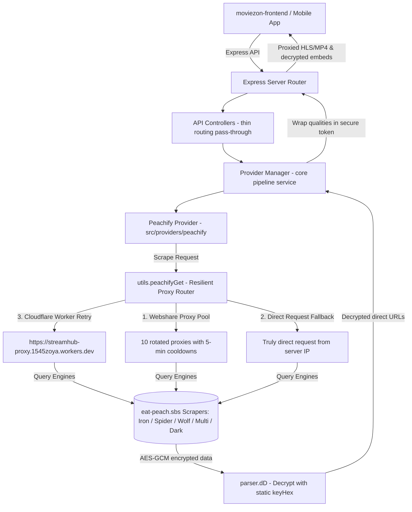
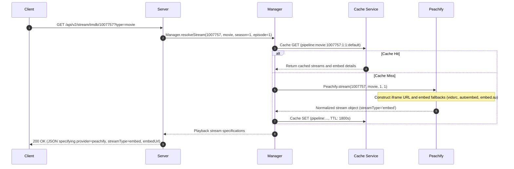
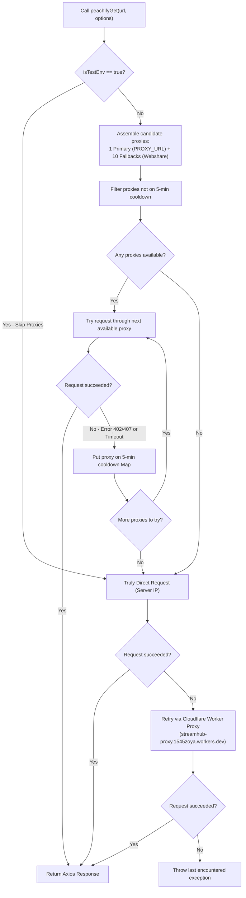

# MovieZon API & Stream Flow Documentation

This document provides a comprehensive technical overview of the **MovieZon Backend API**, detailing its provider-driven architecture, resilient scraping pipeline, dynamic proxy rotation pool, HLS playlist rewriting proxy, secure download tokenization, caching policies, and core lifecycles.

> [!IMPORTANT]
> **Core Architecture Rules (Enforced in Code):**
> 1. **TMDB = Metadata & Discovery Only:** TMDB is **never** a streaming or download provider. It is the metadata source for titles, cast, genres, trailers, and seasons.
> 2. **Peachify as Sole Provider:** The old NetMirror provider has been completely removed from the backend providers. Peachify is the only registered provider in `ProviderManager` and handles all playbacks and downloads.
> 3. **ProviderManager is the Single Source of Truth:** `ProviderManager` handles all pipeline operations (`resolveDetails`, `resolveStream`, `resolveDownload`) and coordinates database queries, TMDB metadata fetches, caching, and fallback checks.
> 4. **No Raw CDN Exposure:** Playback CDN links are proxy-redirected or run through Cloudflare Workers. Download CDN URLs are encrypted using secure AES-256-cbc tokens (`playerService.encryptToken`) and are never exposed as plain text to the frontend.
> 5. **Frontend Agnosticism:** The frontend (React / Flutter) never selects a provider or scraper engine. It invokes backend pipeline endpoints and receives standardized responses.

---

## 🏗️ Architecture Overview

The backend acts as an intelligent proxy, catalog resolver, and security boundary between client applications (web/mobile) and the scraping APIs.



### Active Directory Folder Structure
```
moviezon-backend/
├── src/
│   ├── app/                      # Express app configurations & CORS setup
│   ├── cache/                    # Memory cache service (node-cache wrapper)
│   ├── config/                   # Global configuration parameters
│   ├── controllers/              # Request handlers (apiController.js, historyController.js)
│   ├── logger/                   # Winston logger utility
│   ├── routes/                   # API routes definition (api.js)
│   ├── server.js                 # HTTP server runner and process lifecycles
│   ├── services/                 # Core backend business logic
│   │   ├── player/               # Token encryption, decryption, HLS rewriting, and stream proxying
│   │   ├── provider-manager/     # Unified details, stream, and download resolution pipelines
│   │   └── tmdb/                 # TMDB discovery and normalization wrapper
│   ├── providers/                # Scraping providers
│   │   ├── BaseProvider.js       # Abstract base class enforcing provider contracts
│   │   └── peachify/             # Core Peachify scraper provider
│   │       ├── index.js          # Provider implementation class
│   │       ├── parser.js         # AES-GCM data decryptor helper
│   │       ├── player.js         # Embed & fallback URL constructor
│   │       └── utils.js          # Proxy rotation, cooldowns, and fetch helper
│   └── utils/                    # Data normalizer helpers (normalizer.js)
```

---

## 🔄 Core Lifecycles & Flows

### 1. Unified Search Flow
When a user searches for a movie or TV show, queries go to TMDB first. If TMDB returns empty, the backend falls back to query the in-memory search method of registered providers.

```mermaid
sequenceDiagram
    autonumber
    Client->>Server: GET /api/v2/search?q=Swapped
    Server->>Controllers: Controllers.search("Swapped")
    
    rect rgb(20, 20, 30)
        Note over Controllers: Phase 1: TMDB Query
        Controllers->>TMDB API: GET /search/multi?query=Swapped
        alt TMDB Success
            TMDB API-->>Controllers: Return normalized catalog array
        else TMDB Empty / Failure
            Controllers->>Provider Manager: Manager.search("Swapped")
            Provider Manager->>Cache Service: Cache GET (search:swapped)
            alt Cache Hit
                Cache Service-->>Provider Manager: Return Cached Results
            else Cache Miss
                Provider Manager->>Peachify: Peachify.search("Swapped")
                Peachify-->>Provider Manager: [] (not directly supported by Peachify)
            end
            Provider Manager-->>Controllers: Return matches
        end
    end
    
    Controllers-->>Client: 200 OK (Standard normalized Catalog JSON)
```



---

### 2. Unified Details & Availability Flow
The details pipeline resolves rich TMDB metadata and executes a quick check on Peachify to determine playback stream and download availability.

```mermaid
sequenceDiagram
    autonumber
    Client->>Server: GET /api/v2/details/tmdb/1007757?type=movie
    Server->>Manager: Manager.resolveDetails(1007757, movie)
    
    rect rgb(20, 20, 30)
        Note over Manager: Phase 1 — Metadata Resolution
        Manager->>TMDB Service: fetchDetails(1007757, movie)
        TMDB Service-->>Manager: Returns rich details (title, genres, cast, rating)
    end
    
    rect rgb(10, 30, 10)
        Note over Manager: Phase 2 — Stream & Download Availability Check
        Manager->>Peachify: Peachify.stream(1007757, movie)
        Peachify-->>Manager: Returns Embed & Fallback player URLs
        Note over Manager: Confirm stream availability (isPlayable=true)
    end
    
    Manager-->>Server: Combined details + player metadata + download availability
    Server-->>Client: 200 OK (Normalized results including sources, player and download nodes)
```



---

### 3. Playback Stream Flow (`resolveStream`)
For playing media content, Peachify resolves an iframe-embed player endpoint or returns alternative auto-embed servers.



---

### 4. Download Resolution Flow (`resolveDownload`)
For direct downloading, Peachify scrapes the encrypted endpoints of the 5 scraper engines and decrypts their sources to retrieve HLS or MP4 streams.

```mermaid
sequenceDiagram
    autonumber
    Client->>Server: GET /api/v2/download/tmdb/1007757?type=movie
    Server->>Manager: Manager.resolveDownload(1007757, movie)
    
    Manager->>Peachify: Peachify.download(1007757, movie, 1, 1)
    
    rect rgb(15, 15, 25)
        Note over Peachify: _scrapeDirectStream()
        Peachify->>Peachify: Query Engines (Iron/Spider/Wolf/Multi/Dark) via utils.peachifyGet()
        Note over Peachify: Decrypt payloads using AES-GCM (keyHex)
        Note over Peachify: Extract qualities and stream headers
    end
    
    Peachify-->>Manager: Returns raw qualities array (MP4/HLS URLs + headers)
    
    rect rgb(30, 20, 20)
        Note over Manager: Secure Link Generation (apiController)
        Manager->>Player Service: encryptToken({url, headers, filename})
        Player Service-->>Manager: secureToken String
    end
    
    Manager-->>Server: Qualities array with proxied & tokenized URLs
    Server-->>Client: 200 OK (JSON with tokenized download URLs)
```



---

### 5. Resilient Scraper Request Flow (`peachifyGet`)
To bypass Cloudflare IP bans and request rate limitations, outbound scraper requests are managed using a tiered proxy routing process:



---

## 💾 Resilient Proxy & Fallback Matrix

Peachify uses a multi-tier proxy pipeline to maintain scraping continuity in cloud environments (like Render) which frequently have blocked datacenter IPs.

| Layer | Type | Mechanism | Cooldown / Failover |
| :--- | :--- | :--- | :--- |
| **1. Primary Proxy** | HTTP / HTTPS | Custom residential proxy loaded from `PROXY_URL` environment variable. | Fails over to the fallback pool if not configured or down. |
| **2. Fallback Pool** | Rotated HTTP | 10 static proxies from Webshare dashboard loaded at startup. | Any status `402` (Payment Required), `407` (Proxy Auth), or network error (ECONNRESET, ETIMEDOUT, ECONNREFUSED) places that proxy on a **5-minute cooldown**. |
| **3. Truly Direct** | Direct IP | The Render server issues a request directly. | Used only if all configured proxies fail or are on cooldown. |
| **4. Cloudflare Worker** | Gateway Proxy | Request routed via Cloudflare Worker `streamhub-proxy.1545zoya.workers.dev` with encrypted/encoded Referer, Origin, and User-Agent query params. | Used as a final retry. If this worker also fails, the provider throws a final scraping exception. |
| **5. Embed Fallbacks** | Client Player | If all scraping fails, returns `streamType: 'embed'` referencing public embed endpoints (`peachify.top`, `vidsrc.to`, `autoembed.cc`, `embed.su`). | Handled gracefully in frontend components inside an `iframe`. |

---

## 🔒 Security & Stream Proxy Pipeline

To protect the server, enforce CORS, bypass IP blocks, and parse chunked contents, the backend runs a stream proxy at `/api/v2/stream/proxy`.

### 1. Download Token Encryption (`playerService.encryptToken`)
Download URLs are protected from tampering and IP leakages by wrapping them in secure, temporary state tokens:
* **Algorithm:** `AES-256-CBC`
* **Encryption Key:** Automatically generated at server startup (`PROXY_TOKEN_SECRET`).
* **Payload:** Contains target CDN URL, custom download request headers, and custom formatted target filename (e.g. `Swapped_S1E1_1080p.mp4`).
* **Route:** `/api/v2/stream/proxy?token={iv:encryptedData}&download=true`

### 2. Live HLS (.m3u8) Playlist Rewriting
When an HLS stream (`.m3u8` playlist) is played through the proxy, the proxy fetches the playlist file, rewrites it line-by-line, and returns the modified string:
* **Media Segments & Keys:** Any segment URLs or alternate encryption keys (lines starting with `#EXT-X-KEY` or uri segments) are converted to route back through the stream proxy.
* **Alternate Tracks:** Alternate audio streams (e.g., multilingual track listings) and subtitle tracks defined in `#EXT-X-MEDIA:TYPE=AUDIO` or `TYPE=SUBTITLES` are rewritten dynamically to point to the proxy endpoint, preserving custom headers.

---

## 💾 Caching Strategy

MovieZon uses an in-memory `node-cache` service to minimize outbound API fetches, lower TMDB quota rates, and ensure fast details lookups.

| Cache Type | TTL (Seconds) | Key Pattern | Purpose |
| :--- | :--- | :--- | :--- |
| **Search** | 600s (10 min) | `search:{query}` | Caches TMDB search queries and catalog results. |
| **Details** | 1800s (30 min) | `details:resolved:{type}:{tmdbId}` | Stores TMDB metadata combined with verified Peachify availability. |
| **Stream (Explicit)** | 1800s (30 min) | `stream:{provider}:{type}:{id}:{se}:{ep}:{variant}:{ip}` | Caches explicit stream results. |
| **Pipeline Stream** | 1800s (30 min) | `pipeline:{type}:{tmdbId}:{se}:{ep}:{variantId}` | Caches stream requests resolved by the sequential pipeline. |

---

## 🌐 API Endpoint Reference

### 1. Search Catalog
`GET /api/v2/search?q={query}`

**Response Schema:**
```json
{
  "ok": true,
  "success": true,
  "count": 1,
  "items": [
    {
      "id": "1007757",
      "provider": "tmdb",
      "tmdbId": 1007757,
      "title": "Swapped",
      "originalTitle": "Swapped",
      "year": 2025,
      "type": "movie",
      "rating": 7.3,
      "poster": "https://image.tmdb.org/t/p/w342/...",
      "backdrop": "https://image.tmdb.org/t/p/w780/...",
      "overview": "...",
      "language": "en"
    }
  ],
  "results": [...]
}
```

---

### 2. Unified Details
`GET /api/v2/details/tmdb/:id?type={movie|tv}`

Fetches TMDB metadata and combines it with a quick check on Peachify to verify streaming and download availability.

**Response Schema:**
```json
{
  "ok": true,
  "success": true,
  "results": {
    "id": "1007757",
    "provider": "peachify",
    "providerId": null,
    "tmdbId": 1007757,
    "title": "Swapped",
    "originalTitle": "Swapped",
    "overview": "...",
    "poster": "https://image.tmdb.org/t/p/w500/...",
    "backdrop": "https://image.tmdb.org/t/p/original/...",
    "year": "2025",
    "rating": "TMDB 7.3",
    "genres": ["Comedy", "Sci-Fi"],
    "genre": "Comedy, Sci-Fi",
    "duration": 94,
    "language": "en",
    "cast": [
      {
        "name": "Actor Name",
        "character": "Main Character",
        "profilePath": "..."
      }
    ],
    "director": "Director Name",
    "trailer": "https://www.youtube.com/watch?v=...",
    "seasons": [],
    "recommendations": [],
    "sources": [
      {
        "provider": "peachify",
        "id": "1007757",
        "serverIndex": 1,
        "available": true,
        "downloadSupported": true,
        "languages": ["English"],
        "streamType": "embed",
        "embedUrl": "https://peachify.top/embed/movie/1007757",
        "embedFallbacks": ["vidsrc", "autoembed", "embed.su"],
        "variants": []
      }
    ],
    "defaultProvider": "peachify",
    "supportedAudio": ["English"],
    "supportedSubtitles": [],
    "supportedQualities": [],
    "downloadAvailable": true,
    "player": {
      "provider": "peachify",
      "type": "iframe",
      "available": true,
      "embedUrl": "https://peachify.top/embed/movie/1007757",
      "embedFallbacks": ["vidsrc", "autoembed", "embed.su"]
    },
    "download": {
      "available": true,
      "qualities": []
    }
  }
}
```

---

### 3. Resolve Stream
`GET /api/v2/stream/tmdb/:tmdbId?type={movie|tv}&season={se}&episode={ep}`

Checks cached configurations or constructs the details for Peachify's iframe player.

**Response Schema:**
```json
{
  "ok": true,
  "success": true,
  "available": true,
  "provider": "peachify",
  "selectedProvider": "peachify",
  "fallbackTriggered": false,
  "subjectId": "1007757",
  "streamType": "embed",
  "embedUrl": "https://peachify.top/embed/movie/1007757",
  "embedFallbacks": ["https://vidsrc.to/embed/movie/1007757", "https://autoembed.cc/embed/movie/1007757", "https://embed.su/embed/movie/1007757"],
  "streams": [],
  "variants": [],
  "selectedVariantId": null,
  "stream": {
    "provider": "peachify",
    "drm": false,
    "streamUrl": "",
    "embedUrl": "https://peachify.top/embed/movie/1007757",
    "embedFallbacks": [...],
    "streamType": "embed",
    "subtitles": [],
    "headers": {},
    "qualities": [],
    "variants": [],
    "expires": null
  }
}
```

---

### 4. Resolve Download
`GET /api/v2/download/tmdb/:tmdbId?type={movie|tv}&season={se}&episode={ep}`

Triggers internal Peachify scraper engines (Iron/Spider/Wolf/Multi/Dark), decrypts source URLs, and returns token-encrypted proxied qualities.

**Response Schema:**
```json
{
  "ok": true,
  "success": true,
  "available": true,
  "provider": "peachify",
  "selectedProvider": "peachify",
  "subjectId": "1007757",
  "streams": [
    {
      "quality": "1080p",
      "url": "http://localhost:3000/api/v2/stream/proxy?token=6f23ae9a1b0213...&download=true"
    },
    {
      "quality": "720p",
      "url": "http://localhost:3000/api/v2/stream/proxy?token=8c46f1b1c3098d...&download=true"
    }
  ]
}
```

---

### 5. Watch History
Endpoints used to manage watch progress and history cards. Capped at 100 entries locally (`data/history.json`).

#### A. Fetch History
`GET /api/v2/history`

**Response Schema:**
```json
{
  "ok": true,
  "success": true,
  "items": [
    {
      "tmdbId": 1007757,
      "provider": "peachify",
      "position": 350,
      "progress": 350,
      "duration": 5640,
      "lastWatched": 1782305740000,
      "updatedAt": 1782305740000,
      "movie": {
        "id": 1007757,
        "title": "Swapped",
        "type": "movie",
        "posterPath": "https://image.tmdb.org/t/p/w185/..."
      },
      "playContext": {
        "provider": "peachify",
        "id": "1007757"
      }
    }
  ]
}
```

#### B. Save History
`POST /api/v2/history`

Saves or updates watch history progress.
* **Request Payload:** `{ movie: { id, title, type, posterPath }, progress: 350, duration: 5640, playContext: { provider, id } }`
* **Response:** `{ ok: true, success: true, item: { ... } }`

#### C. Remove Entry
`DELETE /api/v2/history/:type/:id`
* **Response:** `{ ok: true, success: true }`

#### D. Clear History
`DELETE /api/v2/history`
* **Response:** `{ ok: true, success: true }`

---

### 6. Providers Status
`GET /api/providers`
* **Response:** `{ ok: true, providers: [{ name: "peachify", displayName: "Peachify", priority: 1, status: "healthy", message: "Operational", responseTimeMs: 0, lastChecked: "..." }] }`

### 7. Health Check
`GET /api/health`
* **Response:** `{ status: "ok", timestamp: "...", uptime: "...", memory: { rss: "...", heapTotal: "...", heapUsed: "..." }, providers: { peachify: { status: "healthy", message: "Peachify reachable", responseTimeMs: 142 } } }`

---

## ⚡ Integration Testing & Verification

The integrity of the API manager pipelines, caching layers, and token routing is verified using a comprehensive test suite located at [pipeline.test.js](file:///d:/Kalai%20projects/Final-Try/moviezon-backend/src/__tests__/pipeline.test.js).

### Test Suite Execution
Run the integration tests using the native Node.js runner:
```powershell
node --test src/__tests__/pipeline.test.js
```

### Key Test Coverages
1. **Details Pipeline:** Verifies sequential calling, caching layers, and details enrichment flows.
2. **Stream Pipeline:** Verifies that resolving stream returns correct provider configurations.
3. **Download Pipeline:** Verifies that download links are generated with token parameters.
4. **HLS Playlist Rewriter:** Asserts that HLS playlists are correctly rewritten with proxy variables.
5. **Proxy Rotation Test Bypass:** Confirms that `isTestEnv` prevents tests from running requests through Webshare proxies, keeping test executions clean and deterministic.