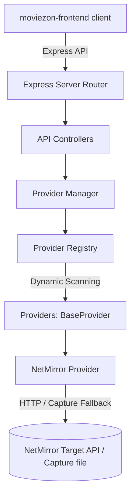
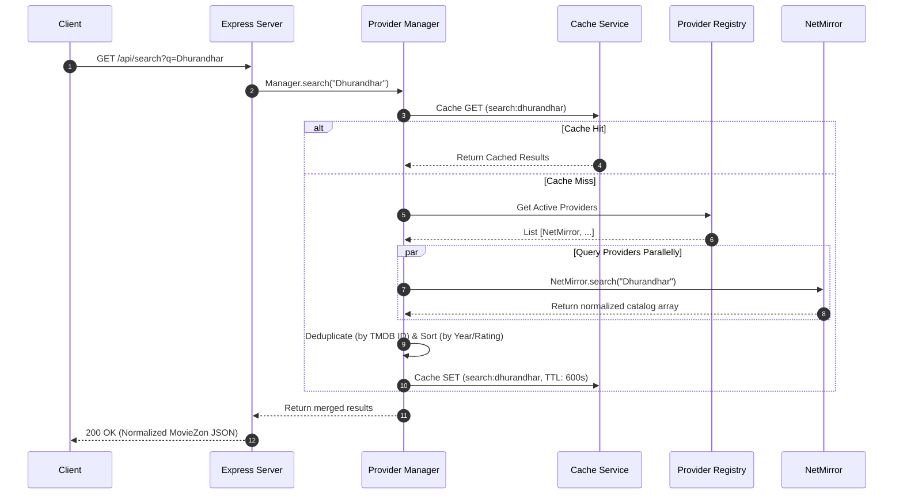
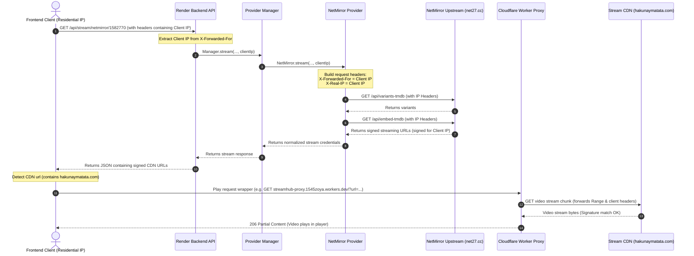

# MovieZon API & Stream Flow Documentation

This document provides a comprehensive technical overview of the **MovieZon Backend API**, detailing its plugin-based provider architecture, database fallback mechanisms, caching strategies, and the specialized IP-forwarding pipeline designed to bypass stream security checks.

---

## 🏗️ Architecture Overview

MovieZon Backend is built on a **decoupled, provider-driven architecture**. The core server is completely agnostic to where data is fetched or how third-party sites lay out their HTML/JSON responses. 



### Key Components

1. **Express Server & Router** (`src/app/` & `src/routes/`): Serves as the gateway, enforcing request structures, CORS rules, and rate limits.
2. **Provider Registry** (`src/provider-registry/`): Discovers sub-providers dynamically at startup by scanning directories within `src/providers/`.
3. **Provider Manager** (`src/provider-manager/`): Orchestrates calls across providers, handles merge/de-duplication algorithms, implements timeouts, and drives automatic failover routing.
4. **BaseProvider Contract** (`src/providers/BaseProvider.js`): Abstract class defining the required client interface for search, details, streams, and health queries.
5. **Concrete Provider (NetMirror)** (`src/providers/netmirror/`): The implementation that translates queries to NetMirror API requests, falling back to local pre-indexed capture datasets if the target goes offline.

---

## 🔄 Core Lifecycles & Flows

### 1. Catalog Search Flow

When a user searches for a movie or TV show, queries are broadcast to all active providers.



---

### 2. Live-Stream Playback & Client IP Forwarding Flow

Because streaming CDNs use IP-restricted signatures, the backend forwards the client's residential IP to NetMirror during variant and embed generation. This ensures that the generated link is signed specifically for the client browser.



---

## 💾 Failover & Fallback Mechanism

To maximize uptime, the NetMirror provider operates a dual-mode mechanism:

1. **Live Check**: First, try a direct HTTP call with configured timeout and retries to `net27.cc`.
2. **Captured Response Lookup**: If the server times out, fails, or blocks the connection (e.g., Cloudflare CAPTCHA), the provider extracts the query pathname (with alphabetically sorted query parameters) and matches it against `net27.cc-capture.json`.
3. **Local Catalog Database**: For search, since the live search endpoint is external, the provider builds an in-memory database of 262 unique movies/shows extracted from the local capture file. It does case-insensitive text searches on title and overview fields.

---

## ⚡ Caching Strategy

MovieZon utilizes a robust Node-Cache layout:
- **Search Caching**: Cached for **10 minutes** (`600` seconds).
- **Details Caching**: Cached for **1 hour** (`3600` seconds).
- **Stream Caching**: Cached for **30 minutes** (`1800` seconds).
  - *Crucial*: Stream cache keys are appended with the client IP (e.g. `stream:netmirror:movie:1291608:1:1:default:157.45.12.98`). This ensures different users do not retrieve other users' IP-restricted stream signatures, avoiding `403 Forbidden` errors.

---

## 🌐 API Endpoint Reference

### 1. Unified Search
`GET /api/search?q={query}`

Retrieves and merges search results across providers.

**Query Parameters:**
- `q` (string, required): Search query.

**Example Response:**
```json
{
  "ok": true,
  "count": 1,
  "items": [
    {
      "id": "1582770",
      "provider": "netmirror",
      "tmdbId": 1582770,
      "imdbId": null,
      "title": "Dhurandhar: The Revenge",
      "originalTitle": "Dhurandhar: The Revenge",
      "year": 2026,
      "type": "movie",
      "language": "en",
      "quality": "1080p",
      "poster": "https://image.tmdb.org/t/p/w185/ptTwQES14pr5c3aZvJg56YlYgb1.jpg",
      "backdrop": "https://image.tmdb.org/t/p/w780/gRoZG3Z0zJxgElmTsVHOl2dNYXe.jpg",
      "overview": "Hamza's mission for his country spirals into a bloody personal war...",
      "duration": null,
      "rating": 7.3,
      "providers": ["netmirror"]
    }
  ]
}
```

---

### 2. Title Details
`GET /api/details/:provider/:id?type={movie|tv}`

Fetches rich metadata for a title.

**Path Parameters:**
- `:provider` (string): Target provider (e.g. `netmirror`).
- `:id` (string/number): TMDB ID.

**Query Parameters:**
- `type` (string, required): `movie` or `tv`.

**Example Response:**
```json
{
  "ok": true,
  "details": {
    "id": "1291608",
    "provider": "netmirror",
    "tmdbId": 1291608,
    "imdbId": null,
    "title": "Dhurandhar",
    "originalTitle": "Dhurandhar",
    "year": 2025,
    "type": "movie",
    "language": "hi",
    "quality": "1080p",
    "poster": "https://image.tmdb.org/t/p/w342/snBOuXDdhmTvlzMUvP9Em3Pp1u1.jpg",
    "backdrop": "https://image.tmdb.org/t/p/original/4DfxcN4w0FuYZHQ3JAHzpHWia1U.jpg",
    "overview": "A mysterious traveler slips into the heart of Karachi's underbelly...",
    "duration": 212,
    "rating": 7.244
  }
}
```

---

### 3. Stream Resolution
`GET /api/stream/:provider/:id?type={movie|tv}&season={1}&episode={1}&variant={variantId}`

Resolves playback links and subtitles.

**Path Parameters:**
- `:provider` (string): Target provider (e.g. `netmirror`).
- `:id` (string/number): TMDB ID.

**Query Parameters:**
- `type` (string, required): `movie` or `tv`.
- `season` (number, optional): TV season number (defaults to `1`).
- `episode` (number, optional): TV episode number (defaults to `1`).
- `variant` (string, optional): Specific language variant/dub ID.

**Example Response:**
```json
{
  "ok": true,
  "stream": {
    "provider": "netmirror",
    "drm": false,
    "streamUrl": "https://bcdnxw.hakunaymatata.com/resource/e9f7f50cd17ea9b81a8904e639b12a00.mp4?sign=03618b601f30f1cfbd4a00af222c7aa1&t=1781860750",
    "subtitles": [
      {
        "lang": "en",
        "name": "English",
        "url": "https://net27.cc/api/captions/tt33014583/en.srt"
      }
    ],
    "headers": {
      "User-Agent": "Mozilla/5.0 (Windows NT 10.0; Win64; x64) AppleWebKit/537.36",
      "Referer": "https://net27.cc/"
    },
    "qualities": [
      {
        "quality": "360p",
        "url": "https://bcdnxw.hakunaymatata.com/bt/61f01abb146e15c0f4d372721b38b693.mp4?sign=7c16ca827487512d2cc234dfdca11592&t=1781858328"
      },
      {
        "quality": "1080p",
        "url": "https://bcdnxw.hakunaymatata.com/resource/e9f7f50cd17ea9b81a8904e639b12a00.mp4?sign=03618b601f30f1cfbd4a00af222c7aa1&t=1781860750"
      }
    ],
    "expires": 1781860750
  }
}
```

---

### 4. Providers List & Health
`GET /api/providers`

**Example Response:**
```json
{
  "ok": true,
  "providers": [
    {
      "name": "netmirror",
      "displayName": "Netmirror",
      "priority": 0,
      "status": "healthy",
      "message": "Reachable",
      "responseTimeMs": 600,
      "lastChecked": "2026-06-19T09:26:18.226Z"
    }
  ]
}
```

---

### 5. Health Check Metrics
`GET /api/health`

**Example Response:**
```json
{
  "status": "ok",
  "timestamp": "2026-06-19T09:26:22.179Z",
  "uptime": "0h 10m 5s",
  "memory": {
    "rss": "71 MB",
    "heapTotal": "38 MB",
    "heapUsed": "23 MB"
  },
  "providers": {
    "netmirror": {
      "status": "healthy",
      "message": "Reachable",
      "responseTimeMs": 600,
      "lastChecked": "2026-06-19T09:26:18.226Z"
    }
  }
}
```
