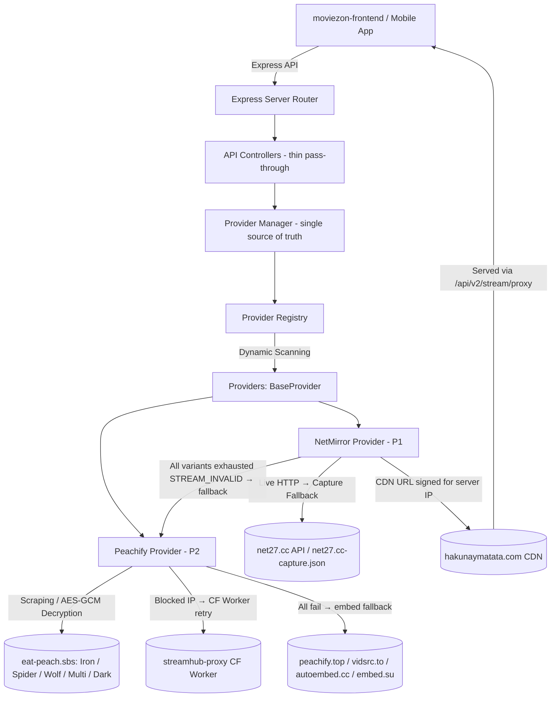
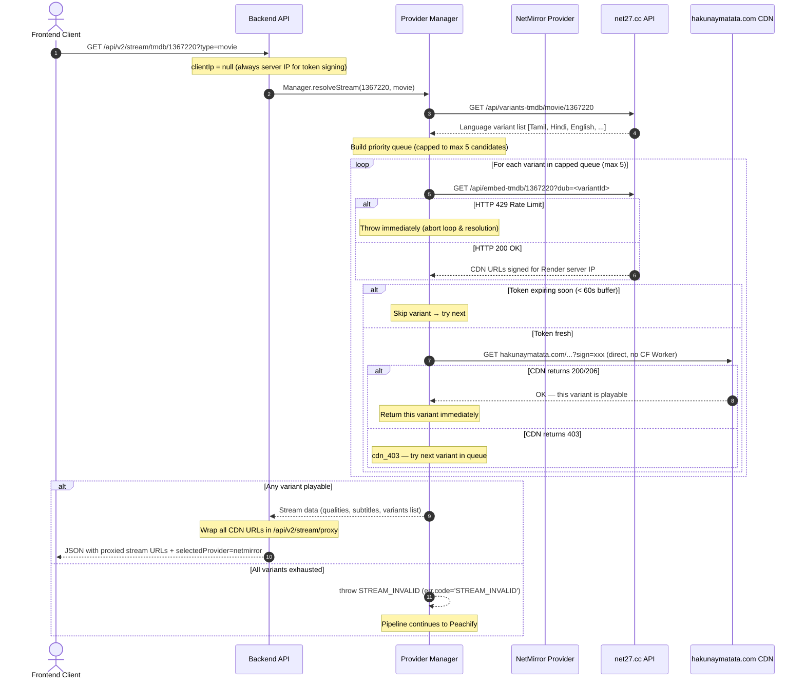
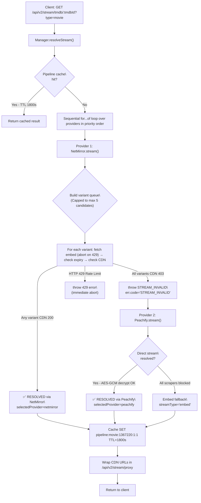
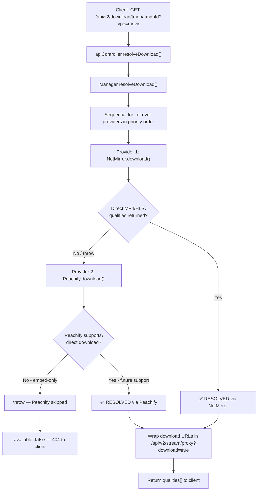
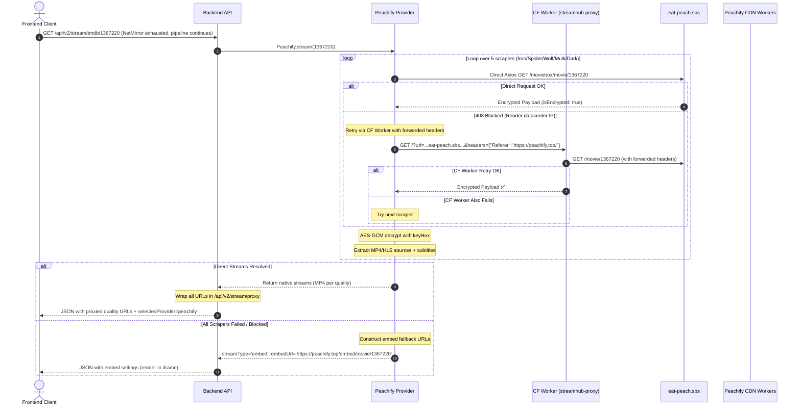

# MovieZon API & Stream Flow Documentation

This document provides a comprehensive technical overview of the **MovieZon Backend API**, detailing its plugin-based provider architecture, sequential multi-provider pipeline, variant retry logic, automatic cross-provider fallback, caching strategies, and the specialized proxy pipeline designed to deliver streams reliably.

> [!IMPORTANT]
> **Core Architecture Rules (enforced in code):**
> 1. `TMDB = Metadata only`. TMDB is **never** a streaming or download provider.
> 2. **Provider priority is always: NetMirror (P1) → Peachify (P2) → future providers**. Never parallel. Never race.
> 3. `ProviderManager` is the **only** place that decides which provider handles a request.
> 4. The Details endpoint **never** resolves stream URLs — only availability status.
> 5. The frontend **never** selects a provider. It calls the backend pipeline endpoint.

---

## 🏗️ Architecture Overview

MovieZon Backend is built on a **decoupled, provider-driven architecture**. The core server is agnostic to where media content is hosted or how third-party providers lay out their metadata.



### Key Components

1. **Express Server & Router** (`src/app/` & `src/routes/`): Gateway enforcing request validation, CORS proxying, and streaming data piping.
2. **Provider Registry** (`src/provider-registry/`): Discovers concrete sub-providers dynamically at startup by scanning `src/providers/`.
3. **Provider Manager** (`src/provider-manager/`): **The only place that decides provider selection.** Runs sequential pipelines for stream, details, and download. Implements deterministic priority ordering, variant retry, and structured error classification.
4. **BaseProvider Contract** (`src/providers/BaseProvider.js`): Abstract class defining the required interface for `search`, `details`, `stream`, `download`, and `health`.
5. **Concrete Providers**:
   * **NetMirror** (`src/providers/netmirror/`): Translates requests into `net27.cc` API calls. Builds a priority-ordered variant queue (Tamil → Hindi → English → default → rest) capped at a maximum of 5 candidates to prevent connection lag and rate limits, and retries CDN validation. If a 429 Rate Limit is encountered, it aborts immediately. CDN tokens are IP-signed for the **backend server's IP**.
   * **Peachify** (`src/providers/peachify/`): Fetches & AES-GCM-decrypts encrypted payloads from `eat-peach.sbs`. Supports optional outbound residential proxy routing via `PROXY_URL`. Falls back to Cloudflare Worker proxy. If all scraping fails, returns an iframe embed fallback. **Peachify is embed-only and never handles download requests.**

---

## 🔄 Core Lifecycles & Flows

### 1. Catalog Search Flow

When a user searches for a movie or TV show, queries go to TMDB first. If TMDB returns empty or fails, the backend falls back to the in-memory local catalog built from NetMirror capture indices.

```mermaid
sequenceDiagram
    autonumber
    Client->>Express Server: GET /api/search?q=Karuppu
    Express Server->>Controllers: Controllers.search("Karuppu")

    rect rgb(20, 20, 30)
        Note over Controllers: Phase 1: TMDB Query
        Controllers->>TMDB API: GET /search/multi?query=Karuppu
        alt TMDB Success
            TMDB API-->>Controllers: Return catalog array
        else TMDB Failure / Empty
            Controllers->>Provider Manager: Manager.search("Karuppu")
            Provider Manager->>Cache Service: Cache GET (search:karuppu)
            alt Cache Hit
                Cache Service-->>Provider Manager: Return Cached Results
            else Cache Miss
                Provider Manager->>NetMirror: NetMirror.search("Karuppu")
                Note over NetMirror: Search local catalog in-memory db (262 titles)
                NetMirror-->>Provider Manager: Return local matches
                Provider Manager->>Cache Service: Cache SET (search:karuppu, TTL: 600s)
            end
            Provider Manager-->>Controllers: Return matches
        end
    end

    Controllers-->>Client: 200 OK (Normalized MovieZon JSON)
```



---

### 2. Details Pipeline — Sequential Availability Check

> [!IMPORTANT]
> The Details endpoint runs a **Phase 2 sequential availability check** to determine `defaultProvider` and `sources`. It calls `provider.stream()` to test availability — but the result is **only used for status flags**, never for CDN URL resolution. Raw CDN URLs are never included in the Details response. This guarantees the Details endpoint never exposes short-lived signed tokens to the frontend.

```mermaid
sequenceDiagram
    autonumber
    actor Client as Frontend Client
    participant Server as Backend API
    participant Manager as Provider Manager
    participant TMDB as TMDB API
    participant NM as NetMirror
    participant PC as Peachify

    Client->>Server: GET /api/v2/details/tmdb/1367220?type=movie
    Server->>Manager: Manager.resolveDetails(1367220, movie)

    rect rgb(20, 20, 30)
        Note over Manager: Phase 1 — TMDB Metadata Fetch
        Manager->>TMDB: GET /movie/1367220 + /credits + /videos
        TMDB-->>Manager: title, cast, poster, trailers
    end

    rect rgb(10, 30, 10)
        Note over Manager: Phase 2 — Sequential Availability Check (NOT parallel)
        Note over Manager: Check NetMirror stream cache first
        alt Stream cached for NetMirror
            Manager->>Manager: Mark NetMirror available=true (no network call)
        else Cache miss
            Manager->>NM: NetMirror.stream(1367220) with timeout
            alt NetMirror stream valid
                NM-->>Manager: available=true (status only, no CDN URL in sources)
            else NetMirror stream invalid / timeout
                NM-->>Manager: available=false
            end
        end

        Note over Manager: Then check Peachify (sequential, after NetMirror)
        alt Stream cached for Peachify
            Manager->>Manager: Mark Peachify available=true (no network call)
        else Cache miss
            Manager->>PC: Peachify.stream(1367220) with timeout
            PC-->>Manager: available=true/false
        end
    end

    Note over Manager: defaultProvider = first available in priority order
    Manager-->>Server: Details + sources[] (availability status only)
    Server-->>Client: 200 OK (title, cast, sources[], defaultProvider)
```



**Example sources[] in Details response:**
```json
"sources": [
  { "provider": "netmirror", "id": "1367220", "available": false },
  { "provider": "peachify",  "id": "1367220", "available": true  }
],
"defaultProvider": "peachify"
```

> [!NOTE]
> `defaultProvider: "peachify"` here is **correct** — it means NetMirror's CDN tokens are currently expired for this title. The pipeline correctly identifies Peachify as the highest-priority **available** provider. When NetMirror tokens are fresh, `defaultProvider: "netmirror"`.

---

### 3. NetMirror Stream Flow — Variant Retry Loop

> [!IMPORTANT]
> 1. A CDN `403` on one variant's signed URL does **NOT** mean NetMirror is offline. It means that specific variant's token is invalid for this IP/timestamp. NetMirror builds a priority queue of language variants, **caps it at a maximum of 5 candidates**, and retries each one before failing. Only after all variants in the capped queue are exhausted does it throw `STREAM_INVALID`.
> 2. If `net27.cc` returns an HTTP `429` (Rate Limited) during any step (fetching variants or direct embed data), the provider **immediately aborts** and propagates the error rather than trying other variants or worker proxy fallbacks.



**Variant failure log pattern:**
```
[NetMirror] Variant queue for ID 1367220: [v1, v2, v3] (3 candidates)
[NetMirror] Trying v1... CDN returned 403. Trying next variant...
[NetMirror] Trying v2... CDN URL verified OK (Status: 206).
[NetMirror] Variant v2 is playable for ID 1367220.
[Pipeline] ✓ RESOLVED via Netmirror in 4231ms
```

---

### 4. Backend Pipeline Stream Flow — resolveStream

> [!IMPORTANT]
> This is the **primary stream endpoint** the frontend must use. The backend decides provider — the frontend never selects NetMirror vs Peachify.



---

### 5. Download Pipeline — resolveDownload

> [!IMPORTANT]
> The frontend **never** selects a provider for downloads. It calls `GET /api/v2/download/tmdb/:tmdbId` and the backend pipeline decides the provider. Peachify is embed-only and is automatically skipped.



---

### 6. Peachify Scraper & Stream Flow

Peachify resolves direct streams by fetching and AES-GCM-decrypting encrypted payloads from 5 `eat-peach.sbs` scraper APIs. If the direct scraper request fails (blocked datacenter IP), Peachify retries via a Cloudflare Worker proxy.



---

## 💾 Failover & Fallback Layers

### NetMirror Fallback Matrix

| Layer | Trigger | Action |
|-------|---------|--------|
| **1. Live Variants API** | Always tried first | `GET net27.cc/api/variants-tmdb/movie/:id` |
| **2. CF Worker (variants)** | Live variants API network error | Retry via `streamhub-proxy.1545zoya.workers.dev` |
| **3. Capture File** | Live API empty/blocked | Serve from `net27.cc-capture.json` (88 dynamic variant mappings indexed) |
| **4. Variant Priority Queue** | Variants available | Build queue: user-specified → Tamil → Hindi → English → defaultSubjectId → rest; **capped to max 5 candidates** |
| **5. HTTP 429 Check** | Rate limit encountered on `net27.cc` | Immediately throw and abort request (bypass proxies and other variants) |
| **6. Token Expiry Check** | Per variant (cheap, no network) | Skip variant if `expires - now < 60s`; try next |
| **7. CDN Check (per variant)** | Per variant (direct fetch, no proxy) | `GET hakunaymatata.com` from Render IP; `403` → try next variant |
| **8. STREAM_INVALID** | All variants CDN 403 | Throw `err.code='STREAM_INVALID'` — ProviderManager tries Peachify |
| **9. Direct Embed (no variants)** | `variants[]` is empty (e.g. some titles) | `GET /api/embed-tmdb` without variant ID |
| **10. Local DB Search** | NetMirror search offline | In-memory catalog from capture (262 titles) |

### Peachify Fallback Matrix

| Layer | Trigger | Action |
|-------|---------|--------|
| **1. Direct Request** | Always tried first | `axios.get(eat-peach.sbs/...)` with browser headers |
| **2. CF Worker + Headers** | Direct returns 403 | Retry via `streamhub-proxy` with `headers=` query param encoding `Referer`, `Origin`, `User-Agent` |
| **3. Next Scraper** | Both fail | Loop to next of 5 scrapers: Iron → Spider → Wolf → Multi → Dark |
| **4. Embed Fallback** | All 5 scrapers fail | Return `streamType: 'embed'` with `peachify.top`, `vidsrc.to`, `autoembed.cc`, `embed.su` URLs |

> [!NOTE]
> Peachify **never handles download requests**. It is embed-only. `resolveDownload()` skips Peachify automatically.

### Error Classification

| Error Code | Meaning | ProviderManager Action |
|---|---|---|
| *(no code — network)* | Provider offline (ECONNREFUSED, 503, DNS fail) | Log `PROVIDER_OFFLINE`, try next provider |
| `STREAM_INVALID` | All CDN variants returned 403 — provider catalog works, tokens invalid | Log `STREAM_INVALID`, try next provider |
| `EMBED_ONLY` | Provider returns embed URL, no direct stream | Accept embed if no direct stream available |

---

## ⚡ Caching Strategy

MovieZon uses an in-memory Node-Cache system with TTL rules:

| Cache Type | TTL | Key Pattern |
|-----------|-----|-------------|
| **Search** | 600s (10 min) | `search:{query}` |
| **Details** | 3600s (1 hour) | `details:{provider}:{type}:{id}` |
| **Stream** | 1800s (30 min) | `stream:{provider}:{type}:{id}:{se}:{ep}:{variant}:{ip}` |
| **Pipeline** | 1800s (30 min) | `pipeline:{type}:{tmdbId}:{se}:{ep}` |

> [!IMPORTANT]
> **Stream Cache & Variant Retry**: The Phase 2 availability check in `resolveDetails()` reads from the stream cache **first** — if a stream for a provider is cached, no network call is made and the provider is marked available. This makes the Details endpoint fast after the first `resolveStream()` call warms the cache.

> [!NOTE]
> The pipeline cache key (`pipeline:movie:1367220:1:1`) stores the full result of `resolveStream()` including `selectedProvider`. On cache hit, the entire pipeline is bypassed.

---

## 🌐 API Endpoint Reference

### 1. Unified Search
`GET /api/search?q={query}`
`GET /api/v2/search?q={query}`

**Query Parameters:**
* `q` (string, required): Search query.

**Example Response:**
```json
{
  "ok": true,
  "success": true,
  "count": 1,
  "items": [
    {
      "id": "1367220",
      "provider": "netmirror",
      "tmdbId": 1367220,
      "title": "Karuppu",
      "originalTitle": "Karuppu",
      "year": 2026,
      "type": "movie",
      "language": "ta",
      "quality": "1080p",
      "poster": "https://image.tmdb.org/t/p/w185/...",
      "overview": "...",
      "rating": "TMDB 7.1",
      "providers": ["netmirror"]
    }
  ]
}
```

---

### 2. Title Details (Unified Metadata & Sequential Availability)
`GET /api/v2/details/tmdb/:id?type={movie|tv}&season={se}&episode={ep}`

Fetches rich TMDB metadata and runs a **sequential** availability check across all providers. Returns availability status — **never raw CDN URLs**.

**Example Response:**
```json
{
  "ok": true,
  "success": true,
  "movie": {
    "id": "1367220",
    "provider": "tmdb",
    "tmdbId": 1367220,
    "title": "Karuppu",
    "overview": "...",
    "poster": "https://image.tmdb.org/t/p/w500/...",
    "year": "2026",
    "rating": "TMDB 7.1",
    "genres": ["Action", "Thriller"],
    "cast": [{ "name": "Actor Name", "character": "Role", "profilePath": "..." }],
    "sources": [
      { "provider": "netmirror", "id": "1367220", "available": false },
      { "provider": "peachify",  "id": "1367220", "available": true  }
    ],
    "defaultProvider": "peachify",
    "variants": [
      { "id": "799599864534515856", "language": "Tamil Dubbed" },
      { "id": "1367220", "language": "Original Audio" }
    ]
  }
}
```

> [!NOTE]
> `sources[].available` is a **status flag only**. No CDN URLs are included. The frontend uses `defaultProvider` to know which server to auto-select for the Watch Now button.

---

### 3. Backend Pipeline Stream (Recommended — frontend uses this)
`GET /api/v2/stream/tmdb/:tmdbId?type={movie|tv}&season={1}&episode={1}&variant={variantId}`

**The backend decides the provider.** The pipeline tries NetMirror (with full variant retry) first, then Peachify. The frontend never picks a provider.

**Path Parameters:**
* `:tmdbId` (number): TMDB movie/show ID.

**Query Parameters:**
* `type` (string, required): `movie` or `tv`.
* `season` (number, optional): TV season (default: `1`).
* `episode` (number, optional): TV episode (default: `1`).
* `variant` (string, optional): Specific dub variant ID (NetMirror).

**Example Response — NetMirror resolved:**
```json
{
  "ok": true,
  "success": true,
  "available": true,
  "provider": "netmirror",
  "selectedProvider": "netmirror",
  "fallbackTriggered": false,
  "streams": [
    { "quality": "360p",  "url": "https://backend.onrender.com/api/v2/stream/proxy?url=..." },
    { "quality": "1080p", "url": "https://backend.onrender.com/api/v2/stream/proxy?url=..." }
  ],
  "subtitles": [
    { "lang": "en", "name": "English", "url": "..." }
  ],
  "stream": {
    "variants": [
      { "id": "1367220", "language": "Original Audio" },
      { "id": "799599864534515856", "language": "Tamil Dubbed" }
    ],
    "expires": 1781940000
  }
}
```

**Example Response — Peachify fallback (NetMirror all variants CDN 403):**
```json
{
  "ok": true,
  "success": true,
  "available": true,
  "provider": "peachify",
  "selectedProvider": "peachify",
  "fallbackTriggered": true,
  "streams": [],
  "streamType": "embed",
  "embedUrl": "https://peachify.top/embed/movie/1367220"
}
```

---

### 4. Explicit Provider Stream (Manual server switching only)
`GET /api/v2/stream/:provider/:id?type={movie|tv}&season={1}&episode={1}`

> [!WARNING]
> Use this endpoint **only** when the user manually selects a server (e.g. "Switch to Server 2"). For all auto-play scenarios, use `/api/v2/stream/tmdb/:tmdbId` above. The frontend must never use this endpoint to implement provider-selection logic.

**Path Parameters:**
* `:provider` (string): `netmirror` or `peachify`.
* `:id` (string/number): Provider-specific content ID or TMDB ID.

---

### 5. Backend Pipeline Download (Backend decides provider)
`GET /api/v2/download/tmdb/:tmdbId?type={movie|tv}&season={1}&episode={1}&variant={variantId}`

**The backend decides the provider for downloads.** NetMirror is always tried first. Peachify is embed-only and automatically skipped.

**Path Parameters:**
* `:tmdbId` (number): TMDB movie/show ID.

**Query Parameters:**
* `type` (string, required): `movie` or `tv`.
* `season` / `episode` (number, optional): For TV content.
* `variant` (string, optional): Specific dub variant ID.

**Example Response — Download available:**
```json
{
  "ok": true,
  "success": true,
  "available": true,
  "provider": "netmirror",
  "selectedProvider": "netmirror",
  "streams": [
    {
      "quality": "360p",
      "url": "https://backend.onrender.com/api/v2/stream/proxy?url=...&download=true"
    },
    {
      "quality": "1080p",
      "url": "https://backend.onrender.com/api/v2/stream/proxy?url=...&download=true"
    }
  ]
}
```

**Example Response — No provider available:**
```json
{
  "ok": false,
  "success": false,
  "available": false,
  "reason": "No provider supports download for this title",
  "streams": []
}
```

---

### 6. Stream Proxy (CORS, Referer & IP-Signing Bypass)
`GET /api/v2/stream/proxy?url={url}&headers={headers}&download={true|false}`

Proxies raw video binary streams to bypass CORS, Referer, and IP-restriction checks enforced by streaming CDNs.

**Query Parameters:**
* `url` (string, required): The target stream URL to proxy.
* `headers` (string, optional): URL-encoded JSON string of extra headers to forward.
* `download` (boolean, optional): If `true`, adds `Content-Disposition: attachment`.
* `filename` (string, optional): Filename for download (defaults to `video.mp4`).

**Key Proxy Logic:**

| Rule | Condition | Action |
|------|-----------|--------|
| **Skip re-proxy** | URL already contains `/stream/proxy` or `/proxy-stream` | Return URL as-is |
| **Extract nested URL** | URL wraps `eat-peach.sbs` / `peachify` proxy (`?url=...`) | Extract nested target URL |
| **CF Worker redirection** | `hakunaymatata.com` URL (playback, not download/subtitle) | Redirect through `streamhub-proxy` to save backend bandwidth |
| **Direct CDN fetch** | `hakunaymatata.com` URL + `download=true` or subtitle | Fetch directly from Render server (IP-signed token compatibility) |
| **Strip worker headers** | URL contains `workers.dev` | Remove `Referer`, `Origin`, `User-Agent` |
| **HLS rewriting** | URL ends in `.m3u8` or contains HLS paths | Fetch playlist, rewrite segment URLs and relative/absolute URI attributes inside comment lines (e.g., `#EXT-X-MEDIA` alternate audio tracks, `#EXT-X-KEY` keys) to route through this proxy |
| **Range passthrough** | Client sends `Range: bytes=x-y` | Forward Range header; return `206 Partial Content` |

---

### 7. Providers List
`GET /api/providers`

**Example Response:**
```json
{
  "ok": true,
  "providers": [
    {
      "name": "netmirror",
      "displayName": "Netmirror",
      "priority": 0,
      "status": "healthy",
      "message": "Reachable",
      "responseTimeMs": 73,
      "lastChecked": "2026-06-21T01:27:24.266Z"
    },
    {
      "name": "peachify",
      "displayName": "Peachify",
      "priority": 2,
      "status": "degraded",
      "message": "Peachify unreachable: Request failed with status code 403",
      "responseTimeMs": 123,
      "lastChecked": "2026-06-21T01:27:24.316Z"
    }
  ]
}
```

> [!NOTE]
> Peachify health shows **degraded** on Render because `peachify.top` homepage is blocked from datacenter IPs. This does **not** affect stream resolution — direct streams are fetched from `eat-peach.sbs` via the CF Worker retry path.

---

### 8. Health Check
`GET /api/health`

**Example Response:**
```json
{
  "status": "ok",
  "timestamp": "2026-06-21T07:10:00.000Z",
  "uptime": "0h 10m 15s",
  "memory": { "rss": "79 MB", "heapTotal": "17 MB", "heapUsed": "15 MB" },
  "providers": {
    "netmirror": { "status": "healthy", "responseTimeMs": 73 },
    "peachify":  { "status": "degraded", "responseTimeMs": 123 }
  }
}
```

---

## 🔑 Key Design Decisions & Known Behaviours

### Sequential Pipeline (No Race Conditions)
All stream and download pipelines use a `for...of` loop over a sorted provider array — **never `Promise.all`**. This guarantees NetMirror is always checked first and its result is final before Peachify is ever considered. The `getSortedProviders()` function sorts by `config.providerPriority` regardless of registration order.

### NetMirror Variant Retry vs. Provider Fallback
CDN `403` on a single variant ≠ provider offline. NetMirror builds a priority-ordered variant queue and exhausts every variant before throwing `STREAM_INVALID`. This distinction ensures Peachify is only used as a true last resort — when every NetMirror language variant's CDN token is invalid for the server IP.

To avoid rate limits (HTTP `429`) and massive latency from checking too many variants sequentially, two optimization layers are enforced in NetMirror's retry logic:
1. **Variant Queue Capping**: The priority queue is capped at a maximum of **5 candidates**. If a title has many variants (e.g., *The Boys* has 15), checking is limited to the top 5 relevant variants (explicit choice → Tamil → Hindi → English → default → others in API order).
2. **Immediate 429 Abortion**: If the NetMirror API (`net27.cc`) returns an HTTP `429` (Rate Limited) during variant details or direct embed fetching, the system **aborts immediately** and propagates the error upward, rather than attempting Cloudflare Worker proxy retries or trying subsequent variants. This fast-fails the provider and allows the pipeline to quickly switch to alternative providers like Peachify.

| Error type | Has `err.code` | Meaning | ProviderManager response |
|---|---|---|---|
| `STREAM_INVALID` | `'STREAM_INVALID'` | NetMirror online; all CDN tokens invalid | Try next provider |
| *(no code)* | `undefined` | Network failure (provider unreachable) | Try next provider |

### IP Signing & Backend Proxy
All CDN tokens from `hakunaymatata.com` are signed for the **backend server's IP** (`clientIp = null`). The CDN check in `NetMirror.stream()` runs directly from the Render server — never via a CF Worker — because the token IP must match the checking IP. Using a CF Worker intermediary introduces a different IP and produces `403` even on valid tokens.

Stream URLs returned to the client are wrapped in `/api/v2/stream/proxy`, which for playback routes through `streamhub-proxy` (to save bandwidth) and for downloads fetches directly from the Render server.

### Frontend Contract
The frontend calls exactly three backend endpoints:
1. `GET /api/v2/details/tmdb/:id` — metadata + availability status
2. `GET /api/v2/stream/tmdb/:tmdbId` — auto-play (backend picks provider)
3. `GET /api/v2/download/tmdb/:tmdbId` — download (backend picks provider)

The frontend **never** passes a provider name to the stream or download endpoint. Provider selection is 100% the backend's responsibility.

### Peachify on Render (Degraded health, functional streams)
Render's datacenter IP is blocked by `eat-peach.sbs`. Peachify bypasses this by routing scraper requests through `streamhub-proxy` Cloudflare Worker, encoding `Referer`, `Origin`, and `User-Agent` headers in the query string. If the CF Worker also returns `403`, Peachify falls back to embed sources.

### Token Expiry Window
CDN tokens contain a `t` Unix timestamp (generation time). Tokens are treated as valid for `3600 − 60 = 3540 seconds`. The 60-second early-rejection buffer ensures the client never receives a URL that expires mid-playback.

### Test Coverage
All architectural rules are enforced by the integration test suite in `src/__tests__/pipeline.test.js` (38 tests, 9 suites — run with `node --test src/__tests__/pipeline.test.js`):

| Suite | Coverage |
|---|---|
| Details Pipeline Phase 2 | Sequential ordering, cache-first, no CDN URLs in sources |
| Stream Pipeline resolveStream | NetMirror always first, sequential fallback, empty stream handling |
| Download Pipeline resolveDownload | NetMirror first, Peachify embed-only skip |
| NetMirror Variant Retry | CDN 403 retry, STREAM_INVALID vs PROVIDER_OFFLINE, token-expired variant skip |
| Provider Priority ordering | `getSortedProviders()` determinism |
| Peachify Resilient Get | Direct, proxy, worker proxy, proxy bypass |
| NetMirror Provider Stream Resolution | Variant list capping to 5, direct request 429 propagation, playability/direct fallback |
| Stream Caching & Pipeline Caching | Cache hit reuse, variant-keyed pipeline caching |
| HLS Playlist Rewriting | Comment URI rewriting for alternate audio / multi-language and keys |
https://peachify/